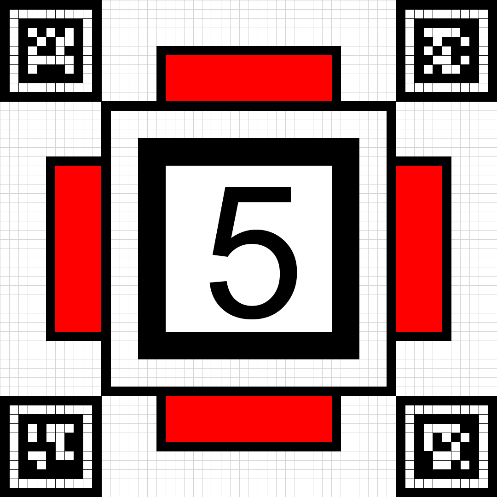

# 📷 OpenCV 三周入门手册

> version: 1.2.0
> 状态：完成

## 一、教学目标

本手册旨在帮助已掌握 Python 和 C++ 基础的同学，在三周时间内比较系统掌握 OpenCV 的核心功能与计算机视觉基础知识。

希望学习完成后，同学们能够：

- 理解图像处理与计算机视觉的基础概念（颜色空间、图像矩阵、滤波、形态学等）
- 熟练使用 OpenCV 进行图像/视频的读写、显示、处理
- 掌握边缘检测、轮廓分析、特征提取与匹配等核心算法
- 使用相机标定、PnP、视觉标签实现目标定位
- 完成综合大作业，将所学知识应用于实践

> 【**注**】本手册**不能**替代系统的计算机视觉课程，仅作为 OpenCV 入门的快速指南。建议结合推荐资料深入学习。

### 学习策略：Python 先行，C++ 优化

本手册采用 **"Python 原型验证 + C++ 性能部署"** 的双语言策略：

- **Python**：语法简洁，适合快速验证算法、熟悉 API、开发原型
- **C++**：性能更高，适合部署到比赛机器人等实时性要求高的场景

建议学习路径：先用 Python 跑通算法流程，再将关键模块迁移到 C++ 进行优化。

---

### 推荐学习资料

>【注】在之后的内容中『』代表可点击的链接

更系统的学习资料请参考以下资源：

**在线教程**：

- 『[OpenCV 官方中文教程（4.x）](https://docs.opencv.ac.cn/4.12.0/d9/df8/tutorial_root.html)』：官方文档的中文翻译，内容权威全面，**强烈推荐**！
- 『[菜鸟教程 - OpenCV 教程](https://www.runoob.com/opencv/opencv-tutorial.html)』：提供 Python 和 C++ 两个版本的简明教程，适合快速入门。
- 『[OpenCV-Python教程介绍](https://kongenen.github.io/pages/4ec038/#opencv)』：一个较为详细的 OpenCV-Python 教程，涵盖基础和进阶内容。
- 『[OpenCV 官方文档（英文）](https://docs.opencv.org/)』：最新最全的官方参考，适合查阅 API。

**书籍推荐**：

- 《Learning OpenCV 4》：适合初学者和进阶，内容涵盖 OpenCV 4 的核心功能。可选 python 和 C++ 版本。中文版名为《学习 OpenCV 4》。

还可以自行搜索相关主题的博客和视频教程，如 Bilibili、YouTube 上的 OpenCV 教学视频，或 Medium、CSDN 等平台的技术文章。

以上资源均适合有一定编程基础的学习者。建议选择一个**能接受学进去**的作为主要材料，其他作为辅助参考。

> 学习 OpenCV 主要以掌握**核心概念**和**常用 API** 为主，建议多动手实践，边学边做。各种算法的**数学原理**和**细节**可根据兴趣深入研究，但**不必过**于纠结于理论推导。

---

## 二、教程安排

教程共 **21 天**，分为三周进行。

| 周次 | 主题 | 核心内容 | 综合实验 |
|:---:|:---|:---|:---|
| **第 1 周** | 图像基础 + OpenCV 入门 + 阈值化 & 形态学 | 像素/通道/颜色空间、读写显示、阈值分割、形态学操作、滤波降噪 | 视频转字符画 |
| **第 2 周** | 边缘检测 + 特征提取 + SVM 分类 + 颜色识别 | Sobel/Canny 边缘检测、轮廓分析、HOG+SVM 分类、HSV 颜色识别 | 手写数字识别 & 颜色追踪 |
| **第 3 周** | 局部特征 + 相机定位 + 视觉标签 | 角点检测、SIFT/ORB 特征、特征匹配、相机标定、PnP、双目视觉、AprilTag | 目标定位系统 |

本教程每天的学习内容包括：

- **📘 知识点**：当天需要掌握的核心概念与 API
- **🔗 学习资料**：推荐的学习资源链接
- **✅ 应知应会 Checklist**：当天学习结束后需要掌握的技能点
- **📝 小任务**：通过编写代码完成的小练习，巩固当天所学内容

> 【**注**】本教程提供的小任务和大作业均为参考示例，学习者可根据自身兴趣进行调整。**不强制要求完成**，完成情况**不计入最终考核评分**。

---

## 三、预期成果

- 同学们能独立编写 OpenCV 程序处理图像/视频
- 能熟练使用阈值、形态学、边缘检测、轮廓分析等基础算法
- 理解特征提取与匹配的原理，能实现简单的目标识别
- 掌握相机标定与 PnP 位姿估计，能进行目标定位
- 完成一个完整的"目标定位系统"大作业

---

## 四、项目结构准备

在开始正式学习之前，我们需要先准备好项目的基本目录结构，方便每天的代码和总结文档进行管理。

### 操作步骤

1. 打开你的工作目录（例如 `D:\my-cv-project` 或 `~/my-cv-project`）
2. 在其中新建一个文件夹：

```
my-cv-project/
 opencv学习/
```

3. 在 `opencv学习` 文件夹下，建立 Week1 ~ Week3 共 **3 个子文件夹**，每周文件夹下再建立 Day 子文件夹：

```
opencv学习/
 Week1/
    Day1/
    Day2/
    ...
    Day7/
 Week2/
    Day8/
    ...
    Day14/
 Week3/
     Day15/
     ...
     Day21/
```

### 文件组织规范

每个 `DayX/` 文件夹下，至少包含：

- 当天的代码文件（Python: `task.py`，C++: `task.cpp`）
- 如果有总结或笔记，推荐使用 **Markdown 文件**（例如 `notes.md`）

例如，`Day1/` 文件夹可能长这样：

```
Day1/
 task.py       # Python** 小任务**代码
 task.cpp      # C++** 小任务**代码（可选）
 data/         # 测试图片/视频
 notes.md      #** 知识点**总结
```

### 提交至 Git 与 GitHub

```bash
cd my-cv-project
git init
git add .
git commit -m "完成 DayX 学习任务"
git remote add origin <你的远程仓库地址>
git push -u origin main
```

> 【**注**】推荐将每日的进度提交到 Git 仓库，养成良好的版本管理习惯。

---

## 五、环境配置

### Day 0：环境搭建

#### 0.1 基本知识点

- 安装 Python 3.x 与 OpenCV
- 配置 C++ OpenCV 开发环境（可选）
- 验证安装是否成功

#### 0.2 学习资料

- 『[菜鸟教程 - OpenCV 安装](https://www.runoob.com/opencv/opencv-install.html)』
- 『[OpenCV 官方安装指南](https://docs.opencv.org/4.x/df/d65/tutorial_table_of_content_introduction.html)』
- C++ 环境配置（基于 CMake）可参考
  - 博客: 『[Vscode+Cmake配置并运行opencv环境(Windows和Ubuntu大同小异)](https://blog.csdn.net/m0_51194302/article/details/126719355)』

> 大体上来说，Python 环境安装较为简单，推荐优先使用 Python 进行学习和实验。C++ 环境配置相对复杂，初学者可根据需要选择性完成。【但请务必保证最终能够顺利使用 C++ 进行开发，最终考核要求使用 C++ 进行开发】

#### 0.3 应知应会 Checklist

- [ ] 会使用 conda/pip 安装 `opencv-python` 和 `opencv-contrib-python`
- [ ] 能在 Python 中 `import cv2` 并打印版本号
- [ ] 【初学时可选】能在 C++ 中编译运行 OpenCV 程序

#### 0.4 小任务

**Python 环境安装**：

```powershell
# 创建虚拟环境（可选）
conda create -n opencv_env python=3.10 -y
conda activate opencv_env

# 安装 OpenCV 及常用库
pip install opencv-python opencv-contrib-python numpy matplotlib
```

**验证安装**：

```python
import cv2
print(f"OpenCV 版本: {cv2.__version__}")
```

C++ 环境配置请参考上述博客链接，根据你的操作系统和 IDE 进行相应设置。

---

## 六、每日学习内容

### 第一周：图像基础与 OpenCV 入门

### Day 1：OpenCV 简介与图像读写

#### 1.1 基本知识点

- 了解 OpenCV 的基本模块与功能（『[OpenCV 基础模块](https://www.runoob.com/opencv/opencv-basic.html)』）
- 感受 Python 与 C++ 接口差异
- OpenCV 图像表示：NumPy 数组与 cv::Mat （『[cv::Mat - 基本图像容器](https://docs.opencv.ac.cn/4.12.0/d6/d6d/tutorial_mat_the_basic_image_container.html)』）【了解即可，可在后续的使用中加深理解】
- BGR 与 RGB 的默认约定（『[【超直白讲解opencv RGB与BGR】RGB模式与BGR模式有什么不同，如何相互转换？](https://blog.csdn.net/weixin_52527544/article/details/128008221)』）
- 图像读取、显示、保存
- 【扩展-可选】了解 OpenCV Core 模块的常用数据类型与操作（『[OpenCV Core 模块](https://docs.opencv.ac.cn/4.12.0/de/d7a/tutorial_table_of_content_core.html)』）

#### 1.2 学习资料

- 『[菜鸟教程 - OpenCV 入门实例](https://www.runoob.com/opencv/opencv-first-example.html)』
- 『[OpenCV 中文教程 - 图像入门](https://docs.opencv.ac.cn/4.12.0/db/deb/tutorial_display_image.html)』

#### 1.3 应知应会 Checklist

- [ ] 理解 OpenCV 的基本模块结构
- [ ] l了解图像在内存中的表示形式
- [ ] 能使用 `cv.imread()` 读取图片
- [ ] 能使用 `cv.imshow()` 显示图片
- [ ] 能使用 `cv.imwrite()` 保存图片
- [ ] 理解 BGR 与 RGB 的区别
- [ ] 【扩展-可选】了解 OpenCV Core 模块的常用数据类型与操作

#### 1.4 小任务

读取一张图片并显示，然后保存为另一个文件。

**Python 示例**：

```python
import cv2 as cv

# 读取图片
img = cv.imread('data/cat.jpg')
if img is None:
    print('无法读取图片')
    exit()

# 显示图片
cv.imshow('My Image', img)
cv.waitKey(0)
cv.destroyAllWindows()

# 保存图片
cv.imwrite('output/cat_copy.png', img)
```

**C++ 示例**：

```cpp
#include <opencv2/opencv.hpp>
using namespace cv;

int main() {
    Mat img = imread("data/cat.jpg");
    if (img.empty()) return -1;
    imshow("My Image", img);
    waitKey(0);
    imwrite("output/cat_copy.png", img);
    return 0;
}
```

---

### Day 2：颜色空间与通道操作

#### 2.1 基本知识点

- BGR、RGB、GRAY、HSV 颜色空间
- 颜色空间转换：`cvtColor()`
- 通道分离与合并：`split()` / `merge()`
- 像素访问与修改
- 基于颜色空间的简单颜色分割：`inRange()`

#### 2.2 学习资料

- 『[OpenCV 中文教程 - 颜色空间转换](https://docs.opencv.ac.cn/4.12.0/df/d9d/tutorial_py_colorspaces.html)』
- 『[OpenCV 中文教程 - 使用 inRange 的阈值操作](https://docs.opencv.ac.cn/4.12.0/da/d97/tutorial_threshold_inRange.html)』
- 相关博客：
  - 『[OpenCV颜色空间详解及转换](https://blog.csdn.net/m0_73815298/article/details/129699151)』

#### 2.3 应知应会 Checklist

- [ ] 能将 BGR 转换为 GRAY、HSV
- [ ] 能分离和合并图像通道
- [ ] 理解 HSV 颜色空间的含义（H: 色调, S: 饱和度, V: 明度）

#### 2.4 小任务

（1）在搜索引擎中查找并了解 BGR、RGB、HSV 颜色空间的区别与应用场景。

（2）用 HSV 颜色空间实现物体颜色分割。

```python
import cv2 as cv

img = cv.imread('data/ball.jpg') # 包含绿色球的图片，也可根据需要更换
hsv = cv.cvtColor(img, cv.COLOR_BGR2HSV)

# 绿色范围（根据实际调整）
low = (35, 80, 40)
high = (85, 255, 255)

mask = cv.inRange(hsv, low, high)
result = cv.bitwise_and(img, img, mask=mask)

cv.imshow('Original', img)
cv.imshow('Mask', mask)
cv.imshow('Result', result)
cv.waitKey(0)
```

---

### Day 3：图像缩放、ROI 与几何变换

#### 3.1 基本知识点

- 图像缩放：`resize()`
- 感兴趣区域（ROI）：数组切片(Python) / `cv::Rect`(C++)
- 几何变换：`remap()`
- 仿射变换：`warpAffine()`
- 透视变换：`warpPerspective()`

#### 3.2 学习资料

- 『[菜鸟教程 - 图像基本操作](https://www.runoob.com/opencv/opencv-image-operator.html)』
- 『[OpenCV 中文教程 - 几何变换](https://docs.opencv.ac.cn/4.12.0/da/d6e/tutorial_py_geometric_transformations.html)』
- 『[OpenCV 中文教程 - ReMap](https://docs.opencv.ac.cn/4.12.0/d1/da0/tutorial_remap.html)』

#### 3.3 应知应会 Checklist

- [ ] 能使用 `resize()` 缩放图像
- [ ] 能通过数组切片获取 ROI
- [ ] 能使用 `remap()` 实现复杂几何变换
- [ ] 能实现图像旋转和透视变换

#### 3.4 小任务

提取图像的 ROI 并缩放显示。

```python
import cv2 as cv

img = cv.imread('data/cat.jpg')

# 提取 ROI (y1:y2, x1:x2)
roi = img[50:300, 100:400]

# 缩放
small = cv.resize(img, (320, 240), interpolation=cv.INTER_LINEAR)
large = cv.resize(roi, None, fx=2, fy=2)

cv.imshow('ROI', roi)
cv.imshow('Small', small)
cv.imshow('Large ROI', large)
cv.waitKey(0)
```

> Remap 和更复杂的几何变换可在后续学习中深入了解。其与 resize 的区别在于：
>
> - resize = 只能做缩放 → 固定规则转换
> - remap = 完整几何变换引擎 → 任意映射、畸变校正、warp 所有操作都靠它

---

### Day 4：阈值分割

#### 4.1 基本知识点

- 全局阈值：`threshold()`
- 自适应阈值：`adaptiveThreshold()`
- OTSU 自动阈值
- 阈值类型：BINARY、BINARY_INV、TRUNC、TOZERO 等
- 【扩展-可选】更多分割方式：如“图像分割与距离变换和分水岭算法”、“通过梯度结构张量进行各向异性图像分割”。

#### 4.2 学习资料

- 『[菜鸟教程 - 图像阈值处理](https://www.runoob.com/opencv/opencv-image-thresholding.html)』
- 『[OpenCV 中文教程 - 图像阈值](https://docs.opencv.ac.cn/4.12.0/d7/d4d/tutorial_py_thresholding.html)』
- 博客：『[OpenCV--图像二值化(Binary Image)](https://zhuanlan.zhihu.com/p/186357948)』
- 【扩展-可选】『[OpenCV 中文教程 - 图像分割与距离变换和分水岭算法](https://docs.opencv.ac.cn/4.12.0/d2/dbd/tutorial_distance_transform.html)』
- 【扩展-可选】『[通过梯度结构张量进行各向异性图像分割](https://docs.opencv.ac.cn/4.12.0/d4/d70/tutorial_anisotropic_image_segmentation_by_a_gst.html)』

#### 4.3 应知应会 Checklist

- [ ] 对比基于 `inRange()` 的颜色阈值分割
- [ ] 能使用全局阈值进行二值化
- [ ] 能使用自适应阈值处理光照不均的图像
- [ ] 理解 OTSU 方法的原理和使用场景
- [ ] 【扩展-可选】了解距离变换和分水岭算法的基本概念
- [ ] 【扩展-可选】了解梯度结构张量在图像分割中的应用

#### 4.4 小任务

比较三种阈值方法的效果。

```python
import cv2 as cv

img = cv.imread('data/text.jpg')
gray = cv.cvtColor(img, cv.COLOR_BGR2GRAY)

# 全局阈值
_, th1 = cv.threshold(gray, 127, 255, cv.THRESH_BINARY)

# OTSU 自动阈值
_, th2 = cv.threshold(gray, 0, 255, cv.THRESH_BINARY + cv.THRESH_OTSU)

# 自适应阈值
th3 = cv.adaptiveThreshold(gray, 255, cv.ADAPTIVE_THRESH_GAUSSIAN_C,
                            cv.THRESH_BINARY, 11, 2)

cv.imshow('Global', th1)
cv.imshow('OTSU', th2)
cv.imshow('Adaptive', th3)
cv.waitKey(0)
```

> 除了上述三种阈值方法外，OpenCV 还提供其他的阈值处理方式，如基于三角形法的自动阈值等，感兴趣的同学可以自行查阅相关资料进行学习。

---

### Day 5：形态学操作

#### 5.1 基本知识点

- 腐蚀：`erode()`  消除噪点、细化边界
- 膨胀：`dilate()`  填充空洞、加粗边界
- 开运算：先腐蚀后膨胀  去除小噪点
- 闭运算：先膨胀后腐蚀  填充小空洞
- 结构元素：`getStructuringElement()`

#### 5.2 学习资料

- 『[菜鸟教程 - 图像形态学操作](https://www.runoob.com/opencv/opencv-image-morphological-operations.html)』
- 『[OpenCV 中文教程 - 形态学变换](https://docs.opencv.ac.cn/4.12.0/d9/d61/tutorial_py_morphological_ops.html)』
- 『[OpenCV 中文教程 - 腐蚀与膨胀](https://docs.opencv.ac.cn/4.12.0/db/df6/tutorial_erosion_dilatation.html)』
- 『[OpenCV 中文教程 - 更多形态学变换](https://docs.opencv.ac.cn/4.12.0/d3/dbe/tutorial_opening_closing_hats.html)』

#### 5.3 应知应会 Checklist

- [ ] 能使用腐蚀和膨胀操作
- [ ] 能使用开闭运算去噪和填洞
- [ ] 理解结构元素的形状和大小对结果的影响

#### 5.4 小任务

对二值图像进行形态学去噪。

```python
import cv2 as cv

img = cv.imread('data/noisy_binary.png', 0)
kernel = cv.getStructuringElement(cv.MORPH_RECT, (5, 5))

# 开运算去除噪点
opened = cv.morphologyEx(img, cv.MORPH_OPEN, kernel)

# 闭运算填充空洞
closed = cv.morphologyEx(img, cv.MORPH_CLOSE, kernel)

cv.imshow('Original', img)
cv.imshow('Opened', opened)
cv.imshow('Closed', closed)
cv.waitKey(0)
```

> 可以尝试不同的卷积核形状（矩形、椭圆、十字形）和大小，交替使用膨胀和腐蚀操作并交换其顺序，观察对结果的影响。

---

### Day 6：图像滤波与降噪

#### 6.1 基本知识点

- 均值滤波：`blur()`  简单平滑
- 高斯滤波：`GaussianBlur()`  适合高斯噪声
- 中值滤波：`medianBlur()`  适合椒盐噪声
- 双边滤波：`bilateralFilter()`  保边平滑

#### 6.2 学习资料

- 『[菜鸟教程 - 图像平滑处理](https://www.runoob.com/opencv/opencv-image-smoothing.html)』
- 『[OpenCV 中文教程 - 图像平滑 1](https://docs.opencv.ac.cn/4.12.0/d4/d13/tutorial_py_filtering.html)』
- 『[OpenCV 中文教程 - 图像平滑 2](https://docs.opencv.ac.cn/4.12.0/dc/dd3/tutorial_gausian_median_blur_bilateral_filter.html)』
- 【扩展-可选】『[离焦模糊滤波器](https://docs.opencv.ac.cn/4.12.0/de/d3c/tutorial_out_of_focus_deblur_filter.html)』
- 【扩展-可选】『[运动去模糊滤波器](https://docs.opencv.ac.cn/4.12.0/d1/dfd/tutorial_motion_deblur_filter.html)』
- 【扩展-可选】『[周期性噪声消除滤波器](https://docs.opencv.ac.cn/4.12.0/d2/d0b/tutorial_periodic_noise_removing_filter.html)』

#### 6.3 应知应会 Checklist

- [ ] 能根据噪声类型选择合适的滤波器
- [ ] 理解各种滤波器的优缺点
- [ ] 能调整滤波器参数以获得最佳效果
- [ ] 【扩展-可选】了解离焦模糊、运动去模糊和周期性噪声消除滤波器的基本原理，使用场景及实现方法

#### 6.4 小任务

比较不同滤波器对椒盐噪声和高斯噪声的处理效果。

```python
import cv2 as cv

img = cv.imread('data/noisy.jpg')

blur = cv.blur(img, (5, 5))
gblur = cv.GaussianBlur(img, (5, 5), 0)
mblur = cv.medianBlur(img, 5)
bblur = cv.bilateralFilter(img, 9, 75, 75)

cv.imshow('Original', img)
cv.imshow('Mean', blur)
cv.imshow('Gaussian', gblur)
cv.imshow('Median', mblur)
cv.imshow('Bilateral', bblur)
cv.waitKey(0)
```

---

### Day 7：视频处理与综合实验

#### 7.1 基本知识点

- 视频读取：`VideoCapture()`
- 视频写入：`VideoWriter()`
- 帧率控制与键盘事件
- 摄像头实时处理

#### 7.2 学习资料

- 『[菜鸟教程 - OpenCV 视频处理 - 1](https://www.runoob.com/opencv/opencv-video.html)』
- 『[菜鸟教程 - OpenCV 视频处理 - 2](https://www.runoob.com/opencv/cpp-opencv-video.html)』
- 『[OpenCV 中文教程 - 视频入门](https://docs.opencv.ac.cn/4.12.0/dd/d43/tutorial_py_video_display.html)』

#### 7.3 应知应会 Checklist

- [ ] 能读取视频文件和摄像头
- [ ] 能逐帧处理视频并显示
- [ ] 能将处理后的视频保存到文件
- [ ] 能使用 `waitKey()` 控制帧率和响应按键

#### 7.4 小任务：视频转字符画

实现一个视频转字符画的程序。

```python
import cv2 as cv
import time

# 读取mp4视频文件,请将路径替换为你的视频文件路径
cap = cv.VideoCapture('./image//bad_apple.mp4')
chars = [' ', '#']  # 二值化：空格表示白，# 表示黑

while True:
    ret, frame = cap.read()
    if not ret or frame is None:
        break
    
    # 转灰度并缩小
    if frame.ndim == 3:
        gray = cv.cvtColor(frame, cv.COLOR_BGR2GRAY)
    else:
        gray = frame
    small = cv.resize(gray, (120, 40))
    
    # 转字符画
    lines = []
    for row in small:
        line = ''.join('#' if pixel > 127 else ' ' for pixel in row)
        lines.append(line)
    ascii_art = '\n'.join(lines)
    
    # 清屏并打印（Windows: cls, Linux/Mac: clear）
    print('\033[H\033[J' + ascii_art)
    
    time.sleep(0.03)  # 控制播放速度，约30fps

cap.release()
```

---

### 第一周小结

#### 第一周 Checklist

- [ ] 能读取、显示、保存图像/视频
- [ ] 能完成基本颜色空间转换和掩膜分割
- [ ] 掌握阈值与形态学的基础概念并能去噪
- [ ] 能搭建基本的实时视频处理管线

#### Python  C++ 移植提示

1. OpenCV 在 Python 和 C++ 中都使用 **BGR** 颜色顺序
2. Python 的 `numpy` 数组对应 C++ 的 `cv::Mat`，注意数据类型匹配
3. C++ 处理大量帧时通常比 Python 快 3-10 倍
4. 函数名基本一致（如 `cvtColor`、`threshold`），但参数形式略有不同

#### 第一周综合任务：C++ 实现视频转字符画

要求：

- 使用 C++ 实现 Day 7 的视频转字符画功能
- 优化性能，保证流畅显示
- 通过形态学操作、滤波等方法提升字符画质量

Day 7 的实现中仅支持使用两个字符（空格和 #），C++ 版本可尝试使用更多字符实现更丰富的灰度表现。例如，使用 10 个字符：`[' ', '.', ':', '-', '=', '+', '*', '#', '%', '@']` 代表十个灰度等级。

---

### 第二周：边缘检测与特征提取

### Day 8：边缘检测

#### 8.1 基本知识点

- Sobel 算子：计算图像梯度
- Laplacian 算子：二阶导数
- Canny 边缘检测：多阶段算法，效果最好

#### 8.2 学习资料

- 『[菜鸟教程 - 边缘检测](https://www.runoob.com/opencv/opencv-image-edge-detection.html)』
- 『[OpenCV 中文教程 - Canny 边缘检测](https://docs.opencv.ac.cn/4.12.0/da/d22/tutorial_py_canny.html)』
- 『[OpenCV 中文教程 - Sobel 导数](https://docs.opencv.ac.cn/4.12.0/d2/d2c/tutorial_sobel_derivatives.html)』
- 『[OpenCV 中文教程 - Laplacian 算子](https://docs.opencv.ac.cn/4.12.0/d5/db5/tutorial_laplace_operator.html)』
- 『[OpenCV 中文教程 - Canny 边缘检测](https://docs.opencv.ac.cn/4.12.0/da/d5c/tutorial_canny_detector.html)』

#### 8.3 应知应会 Checklist

- [ ] 能使用 Sobel 计算 x/y 方向梯度
- [ ] 能使用 Canny 进行边缘检测
- [ ] 理解 Canny 的双阈值原理

#### 8.4 小任务

对图像进行 Canny 边缘检测并显示结果。

```python
import cv2 as cv

img = cv.imread('data/building.jpg')
gray = cv.cvtColor(img, cv.COLOR_BGR2GRAY)

# Sobel
sobelx = cv.Sobel(gray, cv.CV_64F, 1, 0, ksize=3)
sobely = cv.Sobel(gray, cv.CV_64F, 0, 1, ksize=3)

# Canny
edges = cv.Canny(gray, 50, 150)

cv.imshow('Sobel X', cv.convertScaleAbs(sobelx))
cv.imshow('Sobel Y', cv.convertScaleAbs(sobely))
cv.imshow('Canny', edges)
cv.waitKey(0)
```

---

### Day 9：轮廓检测与几何分析

#### 9.1 基本知识点

- 轮廓查找：`findContours()`
- 轮廓绘制：`drawContours()`
- 轮廓属性：面积、周长、边界框、最小外接矩形/圆
- 轮廓近似：`approxPolyDP()`  多边形逼近
- 凸包：`convexHull()`
- 霍夫变换（Hough Transform）：直线检测与圆检测

#### 9.2 学习资料

- 『[菜鸟教程 - 轮廓检测](https://www.runoob.com/opencv/opencv-image-contour-detection.html)』
- 『[OpenCV 中文教程 - 轮廓入门](https://docs.opencv.ac.cn/4.12.0/d4/d73/tutorial_py_contours_begin.html)』
- 『[OpenCV 中文教程 - 轮廓检测](https://docs.opencv.ac.cn/4.12.0/df/d0d/tutorial_find_contours.html)』
- 『[OpenCV 中文教程 - 凸包](https://docs.opencv.ac.cn/4.12.0/d7/d1d/tutorial_hull.html)』
- 『[OpenCV 中文教程 - 边界矩形与最小外接圆](https://docs.opencv.ac.cn/4.12.0/da/d0c/tutorial_bounding_rects_circles.html)』
- 『[OpenCV 中文教程 - 旋转矩形与椭圆](https://docs.opencv.ac.cn/4.12.0/de/d62/tutorial_bounding_rotated_ellipses.html)』
- 『[OpenCV 中文教程 - 霍夫变换（直线）](https://docs.opencv.ac.cn/4.12.0/d9/db0/tutorial_hough_lines.html)』
- 『[OpenCV 中文教程 - 霍夫变换（圆）](https://docs.opencv.ac.cn/4.12.0/d4/d70/tutorial_hough_circle.html)』

#### 9.3 应知应会 Checklist

- [ ] 能使用 `findContours()` 提取轮廓
- [ ] 能计算轮廓的面积、周长、边界框
- [ ] 能使用多边形逼近识别形状（三角形、矩形、圆形）
- [ ] 能使用霍夫变换检测直线和圆

#### 9.4 小任务

检测图像中的几何形状并标注。

```python
import cv2 as cv

img = cv.imread('data/shapes.png')
gray = cv.cvtColor(img, cv.COLOR_BGR2GRAY)
edges = cv.Canny(gray, 50, 150)
contours, _ = cv.findContours(edges, cv.RETR_EXTERNAL, cv.CHAIN_APPROX_SIMPLE)

for cnt in contours:
    area = cv.contourArea(cnt)
    if area < 200:
        continue
    
    # 多边形逼近
    epsilon = 0.02 * cv.arcLength(cnt, True)
    approx = cv.approxPolyDP(cnt, epsilon, True)
    
    # 判断形状
    if len(approx) == 3:
        label = 'Triangle'
    elif len(approx) == 4:
        label = 'Rectangle'
    else:
        label = 'Circle'
    
    # 绘制边界框和标签
    x, y, w, h = cv.boundingRect(cnt)
    cv.rectangle(img, (x, y), (x+w, y+h), (0, 255, 0), 2)
    cv.putText(img, label, (x, y-10), cv.FONT_HERSHEY_SIMPLEX, 0.5, (0, 255, 0), 2)

cv.imshow('Shapes', img)
cv.waitKey(0)
```

---

### Day 10-11：HOG 特征与 SVM 分类

#### 10.1 基本知识点

> HOG + SVM 是经典的目标检测方法，常用于行人检测等任务。其基本流程为：
>
> 1. 收集正负样本图像
> 2. 提取 HOG 特征
> 3. 使用 SVM 训练分类器
> 4. 保存训练好的模型
> 5. 在新图像上提取 HOG 特征并使用 SVM 进行分类

- **HOG**（方向梯度直方图）特征：描述局部梯度方向分布
- **SVM**（支持向量机）分类器
- 训练流程：特征提取  训练  保存模型  推理

> - `scikit-learn` 是一个流行的机器学习库，提供了方便的常用机器学习算法实现，适合快速实验和原型开发。
> - `scikit-learn` 提供了方便的 SVM 实现，但其为 python 生态，与 C++ 兼容性较差。OpenCV 也提供了 SVM 实现，推荐在 C++ 中使用 OpenCV 的 SVM 模块。
> - 除了 SVM，还有其他分类器可选，如**决策树**、**随机森林**、**神经网络**等，但 SVM 是经典且易于实现的入门选择。这些都是**机器学习**的基础内容，感兴趣的同学可以自行查阅相关资料进行学习。

#### 10.2 学习资料

- 博客：『[一文讲解方向梯度直方图（hog）](https://zhuanlan.zhihu.com/p/85829145)』
- 『[scikit-learn SVM 文档](https://scikit-learn.cn/stable/modules/svm.html)』
- 『[OpenCV 中文教程 - SVM](https://docs.opencv.ac.cn/4.12.0/d1/d73/tutorial_introduction_to_svm.html)』
- 『[OpenCV 中文教程 - 非线性 SVM](https://docs.opencv.ac.cn/4.12.0/d0/dcc/tutorial_non_linear_svms.html)』
- 『[HOG + SVM 进行分类的基本流程](https://zhuanlan.zhihu.com/p/75705284)』
- 案例：『[使用 HOG + SVM 实现手写数字分类](https://zhuanlan.zhihu.com/p/425646693)』

#### 10.3 应知应会 Checklist

- [ ] 理解 HOG 特征的原理
- [ ] 能使用 HOG + SVM 实现简单分类器
- [ ] 能保存和加载训练好的模型

#### 10.4 小任务

使用 HOG + SVM 实现手写数字分类。

```python
import cv2 as cv
import numpy as np
from sklearn import svm
from sklearn.model_selection import train_test_split
from sklearn.datasets import load_digits
from skimage.feature import hog
from joblib import dump, load

# 加载数据，这里使用 sklearn 自带的手写数字数据集
digits = load_digits()
X, y = digits.images, digits.target

# 提取 HOG 特征
X_hog = []
for img in X:
    img_uint8 = (img * 16).astype(np.uint8)
    hog = cv.HOGDescriptor((8, 8), (4, 4), (4, 4), (4, 4), 9)
    fd = hog.compute(img_uint8)
    X_hog.append(fd.flatten())
X_hog = np.array(X_hog)

#===== 使用 scikit-learn 的 SVM 实现 =====
# 训练 —— 同时保留原始图像用于可视化
X_train, X_test, imgs_train, imgs_test, y_train, y_test = train_test_split(
    X_hog, X, y, test_size=0.2, random_state=42
)
clf = svm.SVC(kernel='linear')
clf.fit(X_train, y_train)
print(f'准确率: {clf.score(X_test, y_test):.2%}')

# 用原始图像可视化部分测试样本及其预测结果
for i in range(5):
    # imgs_test 存储原始 8x8 浮点图像（0..16），先还原为 uint8 后放大显示
    img = (imgs_test[i] * 16).astype(np.uint8)
    img = cv.resize(img, (200, 200), interpolation=cv.INTER_NEAREST)
    pred = clf.predict([X_test[i]])[0]
    true = y_test[i]
    # 图中添加预测结果文字
    img = cv.cvtColor(img, cv.COLOR_GRAY2BGR)
    cv.putText(img, f'True: {true}', (10, 30), cv.FONT_HERSHEY_SIMPLEX, 0.5, (0, 255, 0), 2)
    cv.putText(img, f'sklearn Pred: {pred}', (10, 70), cv.FONT_HERSHEY_SIMPLEX, 0.5, (255, 0, 0), 2)
    cv.imshow(f'sklearn SVM - True: {true} Pred: {pred}', img)
    cv.waitKey(0)
cv.destroyAllWindows()

# 保存模型
dump(clf, 'hog_svm.joblib')

# ===== 使用 opencv-python 的 SVM 实现（与 scikit-learn 的实现类似）
# 准备数据（OpenCV 要求 float32 的样本矩阵和 int32 的响应）
X_train_cv = X_train.astype(np.float32)
X_test_cv = X_test.astype(np.float32)
y_train_cv = y_train.astype(np.int32)
y_test_cv = y_test.astype(np.int32)

svm_cv = cv.ml.SVM_create()
svm_cv.setType(cv.ml.SVM_C_SVC)
svm_cv.setKernel(cv.ml.SVM_LINEAR)
svm_cv.setTermCriteria((cv.TERM_CRITERIA_MAX_ITER, 1000, 1e-6))

# 训练
train_data = cv.ml.TrainData_create(X_train_cv, cv.ml.ROW_SAMPLE, y_train_cv)
svm_cv.train(train_data)

# 评估准确率
_, resp = svm_cv.predict(X_test_cv)
preds_cv = resp.flatten().astype(np.int32)
acc_cv = (preds_cv == y_test_cv).mean()
print(f'OpenCV SVM 准确率: {acc_cv:.2%}')

# 可视化部分测试样本的预测（来自 OpenCV SVM）
for i in range(5):
    img = (imgs_test[i] * 16).astype(np.uint8)
    img = cv.resize(img, (200, 200), interpolation=cv.INTER_NEAREST)
    img = cv.cvtColor(img, cv.COLOR_GRAY2BGR)
    pred_opencv = int(preds_cv[i])
    true = int(y_test_cv[i])
    cv.putText(img, f'True: {true}', (10, 30), cv.FONT_HERSHEY_SIMPLEX, 0.5, (0, 255, 0), 2)
    cv.putText(img, f'OpenCV Pred: {pred_opencv}', (10, 70), cv.FONT_HERSHEY_SIMPLEX, 0.5, (0, 128, 255), 2)
    cv.imshow(f'OpenCV SVM - True:{true} Pred:{pred_opencv}', img)
    key = cv.waitKey(0)
    if key == 27:  # 按 Esc 可提前退出
        break
cv.destroyAllWindows()

# 保存 OpenCV SVM 模型
svm_cv.save('hog_svm_opencv.yml')
```

---

### Day 12-13：颜色识别与目标追踪

#### 12.1 基本知识点

**目标追踪**（Object Tracking）的核心任务是：在时间序列图像中，对每一帧产生的目标检测结果进行时序关联（temporal association），从而为同一物理实体在不同时间上的观测分配一致的身份标识（ID）。

> 目标追踪的基本流程为：
>
> 1. 通过各种检测方法（颜色、形状、预训练模型等）获取目标位置
> 2. 计算目标的质心或边界框
> 3. 使用各种追踪算法（简单质心追踪、卡尔曼滤波、SORT、Deep SORT、OpenCV 内置追踪器等）进行连续帧的目标位置预测与更新

- HSV 颜色阈值分割
- 连通域分析：`connectedComponentsWithStats()`（对于使用阈值分割后的二值图像可快速提取目标区域）
- 质心计算与追踪（例如使用图像矩、用轮廓的中心）
- 目标跟踪是一个复杂的进阶主题，以下仅介绍几种基础方法：
  - 简单质心追踪（在连续帧中寻找最近质心）
  - 使用 OpenCV 内置追踪器（如 KCF、MIL、CSRT 等）
  - 更多进阶方法如卡尔曼滤波、SORT、Deep SORT 等感兴趣可自行查阅相关资料学习

#### 12.2 学习资料

- 『[OpenCV 中文教程 - 颜色空间](https://docs.opencv.ac.cn/4.12.0/df/d9d/tutorial_py_colorspaces.html)』
- 博客：『[OpenCV 笔记(13)：连通域分析](https://zhuanlan.zhihu.com/p/1941444988983578785)』
- 『[OpenCV 中文教程 - 图像矩](https://docs.opencv.ac.cn/4.12.0/d0/d49/tutorial_moments.html)』
- 『[OpenCV 中文教程 - 目标追踪](https://docs.opencv.ac.cn/4.12.0/d2/d0a/tutorial_introduction_to_tracker.html)』

#### 12.3 应知应会 Checklist

- [ ] 能使用 HSV 进行颜色分割
- [ ] 能使用连通域分析提取目标
- [ ] 能计算目标质心并实现简单追踪

#### 12.4 小任务

实现颜色目标追踪程序。

```python
import cv2 as cv

cap = cv.VideoCapture(0)

while True:
    ret, frame = cap.read()
    if not ret:
        break
    
    hsv = cv.cvtColor(frame, cv.COLOR_BGR2HSV)
    
    # 蓝色范围（可调整）
    mask = cv.inRange(hsv, (100, 80, 40), (130, 255, 255))
    
    # 连通域分析
    num, labels, stats, centroids = cv.connectedComponentsWithStats(mask)
    
    for i in range(1, num):  # 跳过背景
        x, y, w, h, area = stats[i]
        cx, cy = centroids[i]
        if area > 500:  # 过滤小区域
            cv.rectangle(frame, (x, y), (x+w, y+h), (0, 255, 0), 2)
            cv.circle(frame, (int(cx), int(cy)), 5, (0, 0, 255), -1)
    
    cv.imshow('Tracking', frame)
    if cv.waitKey(1) & 0xFF == 27:
        break

cap.release()
cv.destroyAllWindows()
```

---

### Day 14：第二周复习与综合练习

#### 综合任务

1. **手写数字识别**：完善 HOG+SVM 模型，尝试在自己的手写数字上测试
2. **颜色追踪**：实现多颜色目标追踪，显示运动轨迹
3. **边缘与轮廓分析**：对复杂图像进行边缘检测与轮廓分析，识别多种形状
4. **综合应用**：结合边缘检测、轮廓分析与颜色追踪，实现一个简单的视觉特征检测与追踪系统，以下为示意图：



> Tips:
>
> 1. 可以将该视觉特征打印出来，放置在摄像头前进行测试和调试。
> 2. 该视觉特征的四个角分别为 0-3 的 Apriltag 标签（tag25h9 家族），OpenCV 提供了对 AprilTag 的支持，感兴趣的同学可以查阅相关资料进行学习和实现。
> 3. 可以直接通过 AprilTag 标签得到 ROI 区域，然后在该区域内进行颜色分割和轮廓分析，从而实现对标签的颜色特征检测与追踪。在下一周我们将介绍其他局部特征检测与描述子方法，避免对 AprilTag 产生依赖。
> 4. 除了简单的基于 HSV 颜色阈值分割外，还可以尝试：
>    - 使用 K-Means 聚类等方法进行颜色分割，从而提升鲁棒性。
>    - 通过训练一个简单的分类器（如 SVM、决策树、随机森林等）来对颜色进行分类，从而提升识别准确率。

---

### 第三周：局部特征、相机定位与视觉标签

### Day 15：角点检测

#### 15.1 基本知识点

- Harris 角点检测：`cornerHarris()`
- Shi-Tomasi 角点检测：`goodFeaturesToTrack()`
- FAST 角点检测：速度快，适合实时应用

#### 15.2 学习资料

- 『[OpenCV 中文教程 - Harris 角点-1](https://docs.opencv.ac.cn/4.12.0/dc/d0d/tutorial_py_features_harris.html)』
- 『[OpenCV 中文教程 - Harris 角点-2](https://docs.opencv.ac.cn/4.12.0/d4/d7d/tutorial_harris_detector.html)』
- 『[OpenCV 中文教程 - Shi-Tomasi-1](https://docs.opencv.ac.cn/4.12.0/d4/d8c/tutorial_py_shi_tomasi.html)』
- 『[OpenCV 中文教程 - Shi-Tomasi-2](https://docs.opencv.ac.cn/4.12.0/d8/dd8/tutorial_good_features_to_track.html)』
- 『[OpenCV 中文教程 - FAST](https://docs.opencv.ac.cn/4.12.0/df/d0c/tutorial_py_fast.html)』
- 『[OpenCV 中文教程 - 通用角点检测](https://docs.opencv.ac.cn/4.12.0/d9/dbc/tutorial_generic_corner_detector.html#autotoc_md511)』
- 『[OpenCV 中文教程 - 亚像素角点检测](https://docs.opencv.ac.cn/4.12.0/dd/d92/tutorial_corner_subpixels.html)』

#### 15.3 应知应会 Checklist

- [ ] 能使用 Harris 检测角点
- [ ] 能使用 `goodFeaturesToTrack()` 检测强角点
- [ ] 理解角点检测的原理

#### 15.4 小任务

```python
"""角点检测对比示例

使用图像: data/test_image.png
对同一张图分别使用 Harris、Shi-Tomasi、FAST 三种角点检测器进行检测，
并把 原图 + 三种检测结果 组成 2x2 的对比图保存为 output.png

"""
from typing import Tuple

import cv2
import numpy as np

def draw_harris(img: np.ndarray, gray: np.ndarray) -> np.ndarray:
    dst = cv2.cornerHarris(gray, blockSize=2, ksize=3, k=0.04)
    dst = cv2.dilate(dst, None)
    # 阈值：取最大值的 1%
    thresh = 0.01 * dst.max()
    out = img.copy()
    ys, xs = np.where(dst > thresh)
    for (x, y) in zip(xs, ys):
        cv2.circle(out, (x, y), 3, (0, 0, 255), 1)  # 红色
    return out


def draw_shitomasi(img: np.ndarray,
                   gray: np.ndarray, 
                   max_corners=200) -> np.ndarray:
    corners = cv2.goodFeaturesToTrack(gray,
                    maxCorners=max_corners, 
                    qualityLevel=0.01,
                    minDistance=10)
    out = img.copy()
    if corners is not None:
        for c in corners:
            x, y = c.ravel().astype(int)
            cv2.circle(out, (x, y), 4, (0, 255, 0), 1)  # 绿色
    return out


def draw_fast(img: np.ndarray, gray: np.ndarray) -> np.ndarray:
    fast = cv2.FastFeatureDetector_create(threshold=25, 
                                nonmaxSuppression=True)
    kps = fast.detect(gray, None)
    out = cv2.drawKeypoints(img, kps, None, color=(255, 0, 0))  # 蓝色
    return out


def make_grid(a: np.ndarray, 
              b: np.ndarray, 
              c: np.ndarray, 
              d: np.ndarray) -> np.ndarray:
    # 确保四张图同样大小（使用 a 的尺寸）
    h, w = a.shape[:2]

    def fit(img: np.ndarray) -> np.ndarray:
        return cv2.resize(img, (w, h)) if img.shape[:2] != (h, w) else img

    a, b, c, d = fit(a), fit(b), fit(c), fit(d)
    top = np.hstack((a, b))
    bot = np.hstack((c, d))
    grid = np.vstack((top, bot))
    return grid


def load_image(path: str) -> Tuple[np.ndarray, np.ndarray]:
    img = cv2.imread(path)
    if img is None:
        raise FileNotFoundError(f"找不到或无法读取图像: {path}")
    gray = cv2.cvtColor(img, cv2.COLOR_BGR2GRAY)
    return img, gray


def main() -> None:
    in_path = "test_image.png"
    out_path = "output.png"

    img, gray = load_image(in_path)

    harris_img = draw_harris(img, gray)
    shi_img = draw_shitomasi(img, gray)
    fast_img = draw_fast(img, gray)

    # 组成 2x2 网格：左上原图，右上 Harris，左下 Shi-Tomasi，右下 FAST
    grid = make_grid(img, harris_img, shi_img, fast_img)

    # 在每个子图上加文字标注（中文）
    label_font = cv2.FONT_HERSHEY_SIMPLEX
    small = 1 if grid.shape[1] > 800 else 0.7
    thickness = 2
    # 写上 4 个角落的标签
    h, w = grid.shape[:2]
    wh = w // 2
    hh = h // 2
    cv2.putText(grid, '原图', (10, 30), label_font, small, (255, 255, 255), thickness, cv2.LINE_AA)
    cv2.putText(grid, 'Harris', (wh + 10, 30), label_font, small, (255, 255, 255), thickness, cv2.LINE_AA)
    cv2.putText(grid, 'Shi-Tomasi', (10, hh + 30), label_font, small, (255, 255, 255), thickness, cv2.LINE_AA)
    cv2.putText(grid, 'FAST', (wh + 10, hh + 30), label_font, small, (255, 255, 255), thickness, cv2.LINE_AA)

    os.makedirs(os.path.dirname(out_path), exist_ok=True)
    cv2.imwrite(out_path, grid)
    print(f"已保存对比图: {out_path}")


if __name__ == '__main__':
    main()
```

---

### Day 16：特征描述子

#### 16.1 基本知识点

- SIFT：尺度不变特征变换，精度高但较慢
- SURF：加速版 SIFT，需额外安装 `opencv-contrib`，如果仍不可用可跳过
- BRIEF：二进制描述子，速度快但不具尺度不变性
- ORB：快速且免费，适合实时应用
- 特征点与描述子的概念

#### 16.2 学习资料

- 『[OpenCV 中文教程 - SIFT](https://docs.opencv.ac.cn/4.12.0/da/df5/tutorial_py_sift_intro.html)』
- 『[OpenCV 中文教程 - SURF](https://docs.opencv.ac.cn/4.12.0/df/dd2/tutorial_py_surf_intro.html)』（SURF，需额外安装 `opencv-contrib-python`）
- 『[OpenCV 中文教程 - BRIEF](https://docs.opencv.ac.cn/4.12.0/dc/d7d/tutorial_py_brief.html)』
- 『[OpenCV 中文教程 - ORB](https://docs.opencv.ac.cn/4.12.0/d1/d89/tutorial_py_orb.html)』


#### 16.3 应知应会 Checklist

- [ ] 能使用 ORB/SIFT 检测特征点
- [ ] 能计算特征描述子
- [ ] 理解不同描述子的优缺点

#### 16.4 小任务

```python

"""特征描述子展示脚本

任选一张图片作为测试图，按 3x2 网格展示：
第一张为原图（不做特征检测），其余依次展示 SIFT, SURF, BRIEF, AKAZE, ORB 的检测结果。

注意：SURF/BRIEF 依赖于 opencv-contrib 的 xfeatures2d，如果不可用会显示提示信息。
"""

import os
import cv2
import numpy as np
import matplotlib.pyplot as plt


def load_image(path):
    if not os.path.exists(path):
        raise FileNotFoundError(f"未找到测试图片: {path}")
    img = cv2.imread(path, cv2.IMREAD_COLOR)
    if img is None:
        raise IOError(f"无法读取图片: {path}")
    return img


def draw_keypoints(img, keypoints, color=(0, 255, 0)):
    # 返回绘制关键点的彩色图像（RGB）
    out = cv2.drawKeypoints(img, keypoints, None, color, flags=cv2.DRAW_MATCHES_FLAGS_DRAW_RICH_KEYPOINTS)
    out = cv2.cvtColor(out, cv2.COLOR_BGR2RGB)
    return out


def placeholder_text(shape, text):
    h, w = shape[:2]
    out = np.zeros((h, w, 3), dtype=np.uint8)
    cv2.putText(out, text, (10, h // 2), cv2.FONT_HERSHEY_SIMPLEX, 0.8, (255, 255, 255), 2, cv2.LINE_AA)
    return out


def main():
    root = os.path.dirname(os.path.dirname(os.path.dirname(__file__)))
    # 图片相对工作区路径
    img_path = os.path.join(root, 'image', 'feature_map.png')
    img = load_image(img_path)

    # 转为灰度用于检测/描述
    gray = cv2.cvtColor(img, cv2.COLOR_BGR2GRAY)

    results = []

    # 原图（不检测）
    results.append(('Original', cv2.cvtColor(img, cv2.COLOR_BGR2RGB)))

    # 1) SIFT
    try:
        sift = cv2.SIFT_create()
        kp_sift = sift.detect(gray, None)
        print(f"SIFT: {len(kp_sift)} keypoints detected")
        img_sift = draw_keypoints(img, kp_sift)
        results.append(('SIFT', img_sift))
    except Exception as e:
        print(f"SIFT error: {e}")
        results.append(('SIFT', placeholder_text(img.shape, 'SIFT error')))

    # 2) SURF (may be unavailable) — fallback to KAZE
    try:
        surf = None
        # attempt creation in a nested try so we can catch nonfree-build errors
        try:
            if hasattr(cv2, 'xfeatures2d'):
                surf = cv2.xfeatures2d.SURF_create(400)
            else:
                # some builds might expose it differently, try getattr
                x = getattr(cv2, 'xfeatures2d', None)
                if x is not None and hasattr(x, 'SURF_create'):
                    surf = x.SURF_create(400)
        except Exception as e_surf_create:
            print(f"SURF create failed: {e_surf_create}")
            surf = None

        if surf is not None:
            kp_surf = surf.detect(gray, None)
            print(f"SURF: {len(kp_surf)} keypoints detected")
            img_surf = draw_keypoints(img, kp_surf)
            results.append(('SURF', img_surf))
        else:
            # fallback to KAZE when SURF not available or creation failed
            kaze = cv2.KAZE_create()
            kp_kaze = kaze.detect(gray, None)
            print(f"SURF not available, used KAZE: {len(kp_kaze)} keypoints detected")
            img_kaze = draw_keypoints(img, kp_kaze)
            results.append(('KAZE (SURF substitute)', img_kaze))
    except Exception as e:
        print(f"SURF/KAZE unexpected error: {e}")
        results.append(('SURF/KAZE error', placeholder_text(img.shape, 'SURF/KAZE error')))

    # 3) BRIEF (descriptor only, use FAST keypoints)
    try:
        brief = None
        if hasattr(cv2, 'xfeatures2d') and hasattr(cv2.xfeatures2d, 'BriefDescriptorExtractor_create'):
            brief = cv2.xfeatures2d.BriefDescriptorExtractor_create()
        elif hasattr(cv2, 'xfeatures2d') and getattr(cv2.xfeatures2d, 'BriefDescriptorExtractor_create', None):
            brief = cv2.xfeatures2d.BriefDescriptorExtractor_create()

        if brief is None:
            raise AttributeError('BRIEF not available')

        fast = cv2.FastFeatureDetector_create()
        kp_fast = fast.detect(gray, None)
        kp_fast, des = brief.compute(gray, kp_fast)
        n_desc = 0 if des is None else des.shape[0]
        print(f"BRIEF: {len(kp_fast)} keypoints detected, descriptors: {n_desc}")
        img_brief = draw_keypoints(img, kp_fast)
        results.append(('BRIEF', img_brief))
    except Exception as e:
        print(f"BRIEF error or not available: {e}")
        results.append(('BRIEF', placeholder_text(img.shape, 'BRIEF not available')))

    # 4) AKAZE
    try:
        akaze = cv2.AKAZE_create()
        kp_akaze = akaze.detect(gray, None)
        print(f"AKAZE: {len(kp_akaze)} keypoints detected")
        img_akaze = draw_keypoints(img, kp_akaze)
        results.append(('AKAZE', img_akaze))
    except Exception as e:
        print(f"AKAZE error: {e}")
        results.append(('AKAZE', placeholder_text(img.shape, 'AKAZE error')))

    # 5) ORB
    try:
        orb = cv2.ORB_create(nfeatures=500)
        kp_orb = orb.detect(gray, None)
        print(f"ORB: {len(kp_orb)} keypoints detected")
        img_orb = draw_keypoints(img, kp_orb)
        results.append(('ORB', img_orb))
    except Exception as e:
        print(f"ORB error: {e}")
        results.append(('ORB', placeholder_text(img.shape, 'ORB error')))

    # 显示 3x2 网格
    fig, axes = plt.subplots(3, 2, figsize=(12, 16))
    axes = axes.flatten()
    for ax, (title, im) in zip(axes, results):
        ax.imshow(im)
        ax.set_title(title)
        ax.axis('off')

    # 如果 entries 少于6，则填充空白
    for i in range(len(results), 6):
        axes[i].imshow(np.zeros_like(results[0][1]))
        axes[i].set_title('')
        axes[i].axis('off')

    plt.tight_layout()
    plt.show()


if __name__ == '__main__':
    main()
```

---

### Day 17：特征匹配与 RANSAC

#### 17.1 基本知识点

- 暴力匹配：`BFMatcher`
- FLANN 匹配：近似最近邻，更快
- Lowe's ratio test：过滤错误匹配
- RANSAC：鲁棒估计，去除外点

#### 17.2 学习资料

- 『[OpenCV 中文教程 - 特征匹配-1](https://docs.opencv.ac.cn/4.12.0/dc/dc3/tutorial_py_matcher.html)』
- 『[OpenCV 中文教程 - 特征匹配-2](https://docs.opencv.ac.cn/4.12.0/d5/d6f/tutorial_feature_flann_matcher.html)』
- 『[OpenCV 中文教程 - 单应性-1](https://docs.opencv.ac.cn/4.12.0/d1/de0/tutorial_py_feature_homography.html)』
- 『[OpenCV 中文教程 - 单应性-2](https://docs.opencv.ac.cn/4.12.0/d7/dff/tutorial_feature_homography.html)』
- 『[OpenCV 中文教程 - 单应性-3](https://docs.opencv.ac.cn/4.12.0/d9/dab/tutorial_homography.html)』
- 『[OpenCV 中文教程 - 平面物体检测](https://docs.opencv.ac.cn/4.12.0/dd/dd4/tutorial_detection_of_planar_objects.html)』
- 『[OpenCV 中文教程 - AKAZE 特征匹配](https://docs.opencv.ac.cn/4.12.0/db/d70/tutorial_akaze_matching.html)』
- 『[OpenCV 中文教程 - AKAZE 跟踪](https://docs.opencv.ac.cn/4.12.0/dc/d16/tutorial_akaze_tracking.html)』

#### 17.3 应知应会 Checklist

- [ ] 能使用 BFMatcher 进行特征匹配
- [ ] 能使用 ratio test 过滤错误匹配
- [ ] 能使用 RANSAC 估计单应性矩阵

#### 17.4 小任务

```python
"""特征匹配示例脚本

流程：
1. 加载模板图片 `image/OpenCV三周入门手册/feature_map.png`
2. 对模板应用一个随机仿射变换生成测试图
3. 用 ORB 提取特征（关键点 + 描述子）
4. 用 BFMatcher (Hamming) 和 FLANN (LSH) 分别做 KNN 匹配并应用 Lowe 的 ratio test
5. 基于匹配点用 RANSAC 估计仿射并筛除外点（鲁棒估计）
6. 展示并保存 BF 与 FLANN 的匹配效果（上下两图）

注意：脚本使用 4 个空格缩进。
"""

import os
import cv2
import numpy as np
import matplotlib.pyplot as plt
import itertools
import argparse
import time


def load_image(path):
    if not os.path.exists(path):
        raise FileNotFoundError(f"未找到测试图片: {path}")
    img = cv2.imread(path, cv2.IMREAD_COLOR)
    if img is None:
        raise IOError(f"无法读取图片: {path}")
    return img


def random_affine(img, scale_range=(0.6, 0.95), allow_rotation=False, max_angle=0):
    """生成一个缩小 + 位移的仿射变换，保证目标图像完全位于画面内部。

    - scale_range: (min_s, max_s) 缩放比例区间（小于1 为缩小）
    - allow_rotation: 是否允许额外旋转（默认为 False）
    - max_angle: 当 allow_rotation 为 True 时，允许的最大旋转角度（度）
    返回 (warped, M)
    """
    h, w = img.shape[:2]
    # 只做缩放（缩小）和位移，保证缩放后的图像能完全放入原始画布
    s = float(np.random.uniform(scale_range[0], scale_range[1]))
    new_w = int(w * s)
    new_h = int(h * s)

    # 确保至少为 1
    new_w = max(1, new_w)
    new_h = max(1, new_h)

    # 随机位移，使得 [tx, tx+new_w) 在 [0, w) 内
    max_tx = w - new_w
    max_ty = h - new_h
    if max_tx < 0 or max_ty < 0:
        # fallback: 不缩放
        s = 1.0
        new_w, new_h = w, h
        max_tx, max_ty = 0, 0

    tx = int(np.random.randint(0, max_tx + 1)) if max_tx > 0 else 0
    ty = int(np.random.randint(0, max_ty + 1)) if max_ty > 0 else 0

    # 初始为仅缩放和平移的仿射矩阵（关于原点）
    M = np.array([[s, 0, tx],
                  [0, s, ty]], dtype=np.float32)

    if allow_rotation and max_angle > 0:
        angle = np.random.uniform(-max_angle, max_angle)
        # 旋转围绕缩放后图像中心（cx, cy）
        cx = tx + new_w / 2.0
        cy = ty + new_h / 2.0
        R = cv2.getRotationMatrix2D((cx, cy), angle, 1.0)
        # 将 R (2x3) 与缩放/平移 M (2x3) 组合：先缩放平移，再旋转 => R * [M; 0 0 1]
        # 扩展为 3x3 矩阵相乘
        M_ext = np.vstack([M, [0, 0, 1]])
        R_ext = np.vstack([R, [0, 0, 1]])
        M_comb = R_ext.dot(M_ext)
        M = M_comb[:2, :]

    # 使用常数边界，不做平铺/反射
    warped = cv2.warpAffine(img, M, (w, h), borderMode=cv2.BORDER_CONSTANT, borderValue=(0, 0, 0))
    return warped, M


def knn_ratio_test(matcher, des1, des2, ratio=0.75):
    """返回满足 Lowe ratio 的 match 列表"""
    if des1 is None or des2 is None:
        return []
    try:
        matches = matcher.knnMatch(des1, des2, k=2)
    except Exception:
        # 某些 matcher 对 uint8/其他类型敏感
        des1_f = np.asarray(des1, np.uint8) if des1 is not None else None
        des2_f = np.asarray(des2, np.uint8) if des2 is not None else None
        matches = matcher.knnMatch(des1_f, des2_f, k=2)

    good = []
    for m_n in matches:
        if len(m_n) != 2:
            continue
        m, n = m_n
        if m.distance < ratio * n.distance:
            good.append(m)
    return good


def ransac_filter(kp1, kp2, matches, ransac_thresh=3.0):
    """使用 RANSAC 估计仿射并返回内点 matches 和 mask"""
    if len(matches) < 3:
        return matches, None
    pts1 = np.float32([kp1[m.queryIdx].pt for m in matches])
    pts2 = np.float32([kp2[m.trainIdx].pt for m in matches])
    # estimateAffinePartial2D 更适合仿射
    M, mask = cv2.estimateAffinePartial2D(pts1, pts2, method=cv2.RANSAC, ransacReprojThreshold=ransac_thresh)
    if mask is None:
        return matches, None
    mask = mask.ravel().tolist()
    inliers = [m for m, v in zip(matches, mask) if v]
    return inliers, mask, M


def draw_matches(img1, kp1, img2, kp2, matches, mask=None, title=None):
    draw_params = dict(
        flags=cv2.DrawMatchesFlags_NOT_DRAW_SINGLE_POINTS
    )
    if mask is not None:
        draw_params['matchColor'] = (0, 255, 0)
        draw_params['singlePointColor'] = (255, 0, 0)
        draw_params['matchesMask'] = mask
    img_draw = cv2.drawMatches(img1, kp1, img2, kp2, matches, None, **draw_params)
    img_draw = cv2.cvtColor(img_draw, cv2.COLOR_BGR2RGB)
    if title:
        # 在图上加标题（PIL/Matplotlib 显示上层会再显示标题）
        cv2.putText(img_draw, title, (10, 20), cv2.FONT_HERSHEY_SIMPLEX, 0.6, (255, 255, 255), 2)
    return img_draw


def evaluate_params(img, img2, orb_params, ratio, ransac_thresh, flann_params):
    """用给定参数评估 BF 与 FLANN 的 inlier 数量，返回统计和绘图数据"""
    try:
        gray1 = cv2.cvtColor(img, cv2.COLOR_BGR2GRAY)
        gray2 = cv2.cvtColor(img2, cv2.COLOR_BGR2GRAY)

        orb = cv2.ORB_create(**orb_params)
        kp1, des1 = orb.detectAndCompute(gray1, None)
        kp2, des2 = orb.detectAndCompute(gray2, None)

        # BF
        bf = cv2.BFMatcher(cv2.NORM_HAMMING, crossCheck=False)
        good_bf = knn_ratio_test(bf, des1, des2, ratio=ratio)
        inliers_bf, mask_bf, M_bf = ransac_filter(kp1, kp2, good_bf, ransac_thresh=ransac_thresh)

        # FLANN
        try:
            flann = cv2.FlannBasedMatcher(flann_params, dict(checks=50))
            des1_f = np.asarray(des1, np.uint8) if des1 is not None else None
            des2_f = np.asarray(des2, np.uint8) if des2 is not None else None
            good_flann = knn_ratio_test(flann, des1_f, des2_f, ratio=ratio)
            inliers_flann, mask_flann, M_flann = ransac_filter(kp1, kp2, good_flann, ransac_thresh=ransac_thresh)
        except Exception:
            good_flann = []
            inliers_flann = []
            mask_flann = None
            M_flann = None

        return dict(kp1=len(kp1), kp2=len(kp2),
                    kp1_list=kp1, kp2_list=kp2,
                    bf_matches=len(good_bf), bf_inliers=len(inliers_bf), bf_inliers_list=inliers_bf, bf_mask=mask_bf,
                    flann_matches=len(good_flann), flann_inliers=len(inliers_flann), flann_inliers_list=inliers_flann, flann_mask=mask_flann)
    except Exception as e:
        print(f"evaluate_params error: {e}")
        return dict(kp1=0, kp2=0, kp1_list=None, kp2_list=None,
                    bf_matches=0, bf_inliers=0, bf_inliers_list=[], bf_mask=None,
                    flann_matches=0, flann_inliers=0, flann_inliers_list=[], flann_mask=None)


def grid_search(img, img2, max_combos=100, verbose=True):
    # 定义参数网格（可根据需要扩展）
    orb_nfeatures = [1000, 1500]
    orb_scaleFactor = [1.2, 1.3]
    orb_nlevels = [8, 12]
    orb_fastThreshold = [5, 20]
    # 新增描述子/关键点相关参数
    orb_WTA_K = [2, 3]
    orb_patchSize = [16, 31]
    orb_edgeThreshold = [5, 15]
    orb_scoreType = [cv2.ORB_HARRIS_SCORE, cv2.ORB_FAST_SCORE]

    ratio_list = [0.6, 0.75, 0.85]
    ransac_list = [2.0, 3.0, 4.0]

    flann_table_number = [6, 12]
    flann_key_size = [12, 20]
    flann_multi_probe = [1, 2]

    combos = []
    for of, sf, nl, ft, w, ps, et, st, r, rt in itertools.product(
            orb_nfeatures, orb_scaleFactor, orb_nlevels, orb_fastThreshold,
            orb_WTA_K, orb_patchSize, orb_edgeThreshold, orb_scoreType,
            ratio_list, ransac_list):
        for tn, ks, mp in itertools.product(flann_table_number, flann_key_size, flann_multi_probe):
            orb_params = dict(nfeatures=of, scaleFactor=sf, nlevels=nl, fastThreshold=ft,
                              WTA_K=w, patchSize=ps, edgeThreshold=et, scoreType=st)
            flann_params = dict(algorithm=6, table_number=tn, key_size=ks, multi_probe_level=mp)
            combos.append((orb_params, r, rt, flann_params))

    total_combos = len(combos)
    if total_combos == 0:
        return None, None

    # 若组合数超过 max_combos，则使用随机采样（可重复，由 np.random.seed 控制）
    if total_combos > max_combos:
        idxs = np.random.choice(total_combos, size=max_combos, replace=False)
        selected = [combos[i] for i in idxs]
    else:
        selected = combos

    total = len(selected)
    if verbose:
        print(f"Grid search total combos (all): {total_combos}, selected for run: {total}")

    best_bf = None
    best_flann = None
    start = time.time()
    for i, (orb_params, ratio, ransac_thresh, flann_params) in enumerate(selected):
        res = evaluate_params(img, img2, orb_params, ratio, ransac_thresh, flann_params)
        if verbose and (i % 10 == 0):
            print(f"[{i}/{total}] orb={orb_params['nfeatures']},WTA_K={orb_params['WTA_K']},ratio={ratio},ransac={ransac_thresh} -> BF inliers={res['bf_inliers']}, FLANN inliers={res['flann_inliers']}")

        if best_bf is None or res.get('bf_inliers', 0) > best_bf['res'].get('bf_inliers', 0):
            best_bf = dict(res=res, orb_params=orb_params, ratio=ratio, ransac_thresh=ransac_thresh, flann_params=flann_params)
        if best_flann is None or res.get('flann_inliers', 0) > best_flann['res'].get('flann_inliers', 0):
            best_flann = dict(res=res, orb_params=orb_params, ratio=ratio, ransac_thresh=ransac_thresh, flann_params=flann_params)

    elapsed = time.time() - start
    if verbose:
        print(f"Grid search done in {elapsed:.1f}s. Best BF inliers={best_bf['res']['bf_inliers']}, Best FLANN inliers={best_flann['res']['flann_inliers']}")
    return best_bf, best_flann


def main():
    parser = argparse.ArgumentParser()
    parser.add_argument('--grid', action='store_true', help='run grid search to optimize params')
    parser.add_argument('--max-combos', type=int, default=100, help='max parameter combos to try')
    parser.add_argument('--seed', type=int, default=None, help='random seed for repeatability')
    args = parser.parse_args()

    root = os.path.dirname(os.path.dirname(os.path.dirname(__file__)))
    img_path = os.path.join(root, 'image', 'OpenCV三周入门手册', 'feature_map.png')
    img = load_image(img_path)

    if args.seed is not None:
        np.random.seed(args.seed)

    # 生成随机仿射图
    img2, M = random_affine(img)
    print(f"Applied random affine transform:\n{M}")

    # 如果启用网格搜索, 则进行参数优化
    if args.grid:
        best_bf, best_flann = grid_search(img, img2, max_combos=args.max_combos)

        # 把最好结果的匹配图保存下来（使用 evaluate 返回的 kp 列表，避免重新检测导致索引不匹配）
        for label, best in [('BF', best_bf), ('FLANN', best_flann)]:
            res = best['res']
            if label == 'BF':
                matches = res['bf_inliers_list']
                mask = [1] * len(matches) if matches else None
            else:
                matches = res['flann_inliers_list']
                mask = [1] * len(matches) if matches else None

            kp1_list = res.get('kp1_list')
            kp2_list = res.get('kp2_list')
            if kp1_list is None or kp2_list is None:
                # 退化为重新检测（不推荐）
                orb_tmp = cv2.ORB_create(**best['orb_params'])
                kp1_list, _ = orb_tmp.detectAndCompute(cv2.cvtColor(img, cv2.COLOR_BGR2GRAY), None)
                kp2_list, _ = orb_tmp.detectAndCompute(cv2.cvtColor(img2, cv2.COLOR_BGR2GRAY), None)

            title = f"{label} best inliers={best['res'][f'{label.lower()}_inliers']}"
            img_draw = draw_matches(img, kp1_list, img2, kp2_list, matches, mask=mask, title=title)

            out_dir = os.path.join(root, 'image')
            os.makedirs(out_dir, exist_ok=True)
            out_path = os.path.join(out_dir, f'feature_matches_{label.lower()}_best.png')
            cv2.imwrite(out_path, cv2.cvtColor(img_draw, cv2.COLOR_RGB2BGR))
            print(f"Saved {label} best to {out_path}")
        return

    # 以下为默认单次评估（保留之前的行为）
    gray1 = cv2.cvtColor(img, cv2.COLOR_BGR2GRAY)
    gray2 = cv2.cvtColor(img2, cv2.COLOR_BGR2GRAY)

    # ORB 特征
    orb = cv2.ORB_create(nfeatures=1500)
    kp1, des1 = orb.detectAndCompute(gray1, None)
    kp2, des2 = orb.detectAndCompute(gray2, None)
    print(f"ORB: img1 kp={len(kp1)}, img2 kp={len(kp2)}")

    # BFMatcher (Hamming)
    bf = cv2.BFMatcher(cv2.NORM_HAMMING, crossCheck=False)
    good_bf = knn_ratio_test(bf, des1, des2, ratio=0.75)
    print(f"BFMatcher: after ratio test {len(good_bf)} matches")
    inliers_bf, mask_bf, _ = ransac_filter(kp1, kp2, good_bf, ransac_thresh=3.0)
    print(f"BFMatcher: after RANSAC {len(inliers_bf)} inliers")

    # FLANN (LSH for ORB)
    index_params = dict(algorithm=6,  # FLANN_INDEX_LSH
                        table_number=6,
                        key_size=12,
                        multi_probe_level=1)
    search_params = dict(checks=50)
    try:
        flann = cv2.FlannBasedMatcher(index_params, search_params)
        # FLANN 对二进制描述子有时需要 uint8
        des1_f = np.asarray(des1, np.uint8) if des1 is not None else None
        des2_f = np.asarray(des2, np.uint8) if des2 is not None else None
        good_flann = knn_ratio_test(flann, des1_f, des2_f, ratio=0.75)
        print(f"FLANN: after ratio test {len(good_flann)} matches")
        inliers_flann, mask_flann, _ = ransac_filter(kp1, kp2, good_flann, ransac_thresh=3.0)
        print(f"FLANN: after RANSAC {len(inliers_flann)} inliers")
    except Exception as e:
        print(f"FLANN matcher error: {e}")
        good_flann = []
        inliers_flann = []
        mask_flann = None

    # 绘制匹配（仅绘制内点）
    img_bf = draw_matches(img, kp1, img2, kp2, inliers_bf, mask=[1] * len(inliers_bf) if inliers_bf else None)
    img_flann = draw_matches(img, kp1, img2, kp2, inliers_flann, mask=[1] * len(inliers_flann) if inliers_flann else None)

    # 显示上( BF ) 下( FLANN ) 两图
    fig, axes = plt.subplots(2, 1, figsize=(14, 12))
    axes[0].imshow(img_bf)
    axes[0].set_title(f"BFMatcher (inliers: {len(inliers_bf)})")
    axes[0].axis('off')

    axes[1].imshow(img_flann)
    axes[1].set_title(f"FLANN (inliers: {len(inliers_flann)})")
    axes[1].axis('off')

    plt.tight_layout()

    # 保存对比图
    out_dir = os.path.join(root, 'image')
    os.makedirs(out_dir, exist_ok=True)
    out_path = os.path.join(out_dir, 'feature_matches_compare.png')
    fig.savefig(out_path)
    print(f"Saved comparison image to: {out_path}")

    plt.show()


if __name__ == '__main__':
    main()
```

---

### Day 18：相机标定

#### 18.1 基本知识点

- 相机内参矩阵 K
- 畸变系数（径向、切向）
- 棋盘格标定流程
- 畸变校正：`undistort()`

#### 18.2 学习资料

- 『[OpenCV 中文教程 - 创建校准图案](https://docs.opencv.ac.cn/4.12.0/da/d0d/tutorial_camera_calibration_pattern.html)』
- 『[OpenCV 中文教程 - 相机标定-1](https://docs.opencv.ac.cn/4.12.0/dc/dbb/tutorial_py_calibration.html)』
- 『[OpenCV 中文教程 - 相机标定-2](https://docs.opencv.ac.cn/4.12.0/d4/d94/tutorial_camera_calibration.html)』

#### 18.3 应知应会 Checklist

- [ ] 理解相机内参和畸变的概念
- [ ] 能使用棋盘格进行相机标定
- [ ] 能对图像进行畸变校正

#### 18.4 小任务

可自己用 A4 打印一个 9x6 的棋盘格图案，拍摄多张不同角度的照片，放在 `data/calib/` 目录下，然后运行以下代码进行标定。

```python
import cv2 as cv
import numpy as np
import glob

# 棋盘格内角点数量
pattern_size = (9, 6)

objp = np.zeros((pattern_size[0] * pattern_size[1], 3), np.float32)
objp[:, :2] = np.mgrid[0:9, 0:6].T.reshape(-1, 2)

objpoints, imgpoints = [], []
images = glob.glob('data/calib/*.jpg')

for fname in images:
    img = cv.imread(fname)
    gray = cv.cvtColor(img, cv.COLOR_BGR2GRAY)
    ret, corners = cv.findChessboardCorners(gray, pattern_size, None)
    if ret:
        objpoints.append(objp)
        imgpoints.append(corners)

ret, mtx, dist, rvecs, tvecs = cv.calibrateCamera(
    objpoints, imgpoints, gray.shape[::-1], None, None)

print('相机内参:\n', mtx)
print('畸变系数:', dist.ravel())
```

---

### Day 19：PnP 位姿估计

#### 19.1 基本知识点

- PnP 问题：已知 3D-2D 点对，求相机位姿
- `solvePnP()` 函数
- 旋转向量与旋转矩阵：`Rodrigues()`

#### 19.2 学习资料

- 『[OpenCV 中文教程 - 姿态估计](https://docs.opencv.ac.cn/4.12.0/d7/d53/tutorial_py_pose.html)』
- 『[OpenCV 中文教程 - 实时姿态估计](https://docs.opencv.ac.cn/4.12.0/dc/d2c/tutorial_real_time_pose.html)』

#### 19.3 应知应会 Checklist

- [ ] 理解 PnP 问题
- [ ] 能使用 `solvePnP()` 估计位姿
- [ ] 能将旋转向量转换为旋转矩阵

#### 19.4 小任务

```python
"""
Brief demo:
 - Create a small 3D cube and its vertices
 - Project the cube into a simulated camera image to obtain image points (simulate detection)
 - Use OpenCV's solvePnP to recover pose and compute distance
 - Visualize original projection and reprojected points with matplotlib

Run: python PNP.py
Requires: numpy, opencv-python (or opencv-contrib-python), matplotlib
"""

import sys
import math
import numpy as np
import cv2
import matplotlib.pyplot as plt


def create_cube(size=0.1):
    """返回立方体的 8 个顶点（单位：米），中心在原点。"""
    s = size / 2.0
    pts = np.array([
        [-s, -s, -s], [s, -s, -s], [s, s, -s], [-s, s, -s],
        [-s, -s, s], [s, -s, s], [s, s, s], [-s, s, s],
    ], dtype=np.float32)
    return pts


def camera_matrix(fx, fy, cx, cy):
    """构造相机内参矩阵 K。"""
    return np.array([[fx, 0, cx], [0, fy, cy], [0, 0, 1]], dtype=np.float64)


def draw_cube_on_image(img, imgpts, color=(0, 255, 0), thickness=2):
    """在图像上画出立方体的线框（输入为 8 个 2D 点）。"""
    imgpts = imgpts.reshape(-1, 2).astype(int)
    # 底面
    for i, j in [(0, 1), (1, 2), (2, 3), (3, 0)]:
        cv2.line(img, tuple(imgpts[i]), tuple(imgpts[j]), color, thickness)
    # 顶面
    for i, j in [(4, 5), (5, 6), (6, 7), (7, 4)]:
        cv2.line(img, tuple(imgpts[i]), tuple(imgpts[j]), color, thickness)
    # 竖直边
    for i, j in [(0, 4), (1, 5), (2, 6), (3, 7)]:
        cv2.line(img, tuple(imgpts[i]), tuple(imgpts[j]), color, thickness)


def main():
    # --- 配置 ---
    img_w, img_h = 800, 600
    fx = fy = 800.0
    cx, cy = img_w / 2.0, img_h / 2.0
    K = camera_matrix(fx, fy, cx, cy)

    # 立方体尺寸（米）
    cube = create_cube(size=0.2)

    # 定义真实的物体位姿（相机坐标系下），后续用 PnP 恢复
    # 平移（x, y, z）——物体位于相机前方
    t_true = np.array([[0.05], [0.0], [1.5]], dtype=np.float64)  # 1.5m 前方
    # 旋转：对 X、Y、Z 轴施加小角度
    rx, ry, rz = math.radians(10), math.radians(-5), math.radians(15)
    Rx = cv2.Rodrigues(np.array([rx, 0, 0]))[0]
    Ry = cv2.Rodrigues(np.array([0, ry, 0]))[0]
    Rz = cv2.Rodrigues(np.array([0, 0, rz]))[0]
    R_true = Rz @ Ry @ Rx
    rvec_true = cv2.Rodrigues(R_true)[0]

    # 将 3D 点投影到图像平面
    imgpts_true, _ = cv2.projectPoints(cube, rvec_true, t_true, K, distCoeffs=None)

    # 添加高斯噪声，模拟检测误差（像素级）
    noise_std_px = 1.0
    imgpts_noisy = imgpts_true.reshape(-1, 2) + np.random.normal(0, noise_std_px, (8, 2))

    # 使用 solvePnP 求解位姿
    success, rvec_est, tvec_est = cv2.solvePnP(cube, imgpts_noisy, K, None, flags=cv2.SOLVEPNP_ITERATIVE)
    if not success:
        print('solvePnP failed')
        sys.exit(1)

    # 重投影用于比较
    reproj, _ = cv2.projectPoints(cube, rvec_est, tvec_est, K, None)

    # 计算距离（相机中心到物体原点）
    dist_true = np.linalg.norm(t_true)
    dist_est = np.linalg.norm(tvec_est)

    # 打印结果摘要
    print('--- PnP distance demo ---')
    print(f'True translation (m): {t_true.ravel()}, True distance: {dist_true:.3f} m')
    print(f'Estimated translation (m): {tvec_est.ravel()}, Estimated distance: {dist_est:.3f} m')
    print('rvec_true:', rvec_true.ravel())
    print('rvec_est :', rvec_est.ravel())

    # 可视化：左为真实投影与检测点（红点），右为重投影（估计）
    img_orig = np.ones((img_h, img_w, 3), dtype=np.uint8) * 255
    img_reproj = img_orig.copy()

    # 画出真实投影（绿色）与带噪声检测（红点）
    draw_cube_on_image(img_orig, imgpts_true)
    for p in imgpts_noisy:
        cv2.circle(img_orig, tuple(p.astype(int)), 4, (0, 0, 255), -1)

    # 画出重投影（蓝色）
    draw_cube_on_image(img_reproj, reproj, color=(255, 0, 0))

    # 使用 Matplotlib 显示两张图像和 3D 示意
    fig = plt.figure(figsize=(12, 5))
    ax1 = fig.add_subplot(1, 3, 1)
    ax1.imshow(cv2.cvtColor(img_orig, cv2.COLOR_BGR2RGB))
    ax1.set_title('True projection + detections (red dots)')
    ax1.axis('off')

    ax2 = fig.add_subplot(1, 3, 2)
    ax2.imshow(cv2.cvtColor(img_reproj, cv2.COLOR_BGR2RGB))
    ax2.set_title('Reprojection (blue lines)')
    ax2.axis('off')

    # 3D 示意：立方体与相机位置（相机在原点）
    ax3 = fig.add_subplot(1, 3, 3, projection='3d')
    cube_cam = (R_true @ cube.T).T + t_true.ravel()
    ax3.scatter(cube_cam[:, 0], cube_cam[:, 1], cube_cam[:, 2], c='g')
    ax3.scatter([0], [0], [0], c='r', marker='^', s=60)
    ax3.set_xlabel('X (m)')
    ax3.set_ylabel('Y (m)')
    ax3.set_zlabel('Z (m)')
    ax3.set_title('In camera coords: cube (green) and camera (red)')
    ax3.view_init(elev=20, azim=-60)

    plt.tight_layout()
    plt.show()

    # 简要说明 PnP 流程（中文注释）
    print('\nPNP 简要流程：')
    print('1）已知物体上若干已知 3D 点（物体坐标系）及对应的 2D 图像点（像素）')
    print('2）给定相机内参矩阵 K，使用 solvePnP 求解 rvec 和 tvec（物体相对相机的位姿）')
    print('3）tvec 的范数给出相机到物体原点的距离；位姿可用于重投影验证')


if __name__ == "__main__":
    main()
```

---

### Day 20：双目视觉与深度估计

#### 20.1 基本知识点

- 双目立体匹配
- 视差图计算：StereoBM / StereoSGBM
- 深度计算：`depth = f * B / disparity`

#### 20.2 学习资料

- 『[OpenCV 中文教程 - 立体图像深度图](https://docs.opencv.ac.cn/4.12.0/dd/d53/tutorial_py_depthmap.html)』

#### 20.3 应知应会 Checklist

- [ ] 理解双目视觉原理
- [ ] 能计算视差图
- [ ] 能从视差图计算深度

#### 20.4 小任务

```python
# -*- coding: utf-8 -*-
"""
双目视觉示例：从左右摄像头视频生成视差图并保存为视频（默认把帧缩小2倍以降低计算量）
使用方法:
    python 双目视觉.py --left image/camera_left.mp4 --right image/camera_right.mp4 --output disparity.mp4

输出为带伪彩色的视差可视化视频。
"""

import argparse
import cv2
import numpy as np
import sys


def make_stereo_sgbm(min_disp=0, num_disp=128, block_size=5, channels=1):
    # num_disp 必须是 16 的倍数
    num_disp = max(16, (num_disp + 15) // 16 * 16)
    if num_disp <= 0:
        num_disp = 16

    P1 = 8 * channels * block_size * block_size
    P2 = 32 * channels * block_size * block_size

    stereo = cv2.StereoSGBM_create(
        minDisparity=min_disp,
        numDisparities=num_disp,
        blockSize=block_size,
        P1=P1,
        P2=P2,
        disp12MaxDiff=1,
        preFilterCap=63,
        uniquenessRatio=10,
        speckleWindowSize=100,
        speckleRange=32,
        mode=cv2.StereoSGBM_MODE_SGBM_3WAY,
    )
    return stereo


def normalize_disp_for_display(disp):
    # 输入 disp: int16 或 float32 (16倍 disparity)，需要归一化到 0-255 并转换为 uint8
    disp_float = disp.astype(np.float32) / 16.0  # StereoSGBM 输出乘以16
    # 将无效值（小于等于 0）设为 0
    disp_float[disp_float < 0] = 0
    disp_norm = cv2.normalize(disp_float, None, alpha=0, beta=255, norm_type=cv2.NORM_MINMAX)
    disp_uint8 = np.uint8(disp_norm)
    return disp_uint8


def main():
    parser = argparse.ArgumentParser(description='Stereo SGBM disparity video generator')
    parser.add_argument('--left', type=str, default='image/camera_left.mp4', help='Left video path')
    parser.add_argument('--right', type=str, default='image/camera_right.mp4', help='Right video path')
    parser.add_argument('--output', type=str, default='disparity_output.mp4', help='Output disparity video path')
    parser.add_argument('--scale', type=float, default=1, help='Resize scale (e.g., 0.5 means half size)')
    parser.add_argument('--numdisp', type=int, default=128, help='numDisparities (will be rounded up to multiple of 16)')
    parser.add_argument('--block', type=int, default=9, help='blockSize (odd number)')
    parser.add_argument('--show', action='store_true', help='Show live window')
    args = parser.parse_args()

    capL = cv2.VideoCapture(args.left)
    capR = cv2.VideoCapture(args.right)

    if not capL.isOpened():
        print('无法打开左视频:', args.left)
        sys.exit(1)
    if not capR.isOpened():
        print('无法打开右视频:', args.right)
        sys.exit(1)

    # 获取帧率、尺寸等信息
    fpsL = capL.get(cv2.CAP_PROP_FPS) or 25.0
    fpsR = capR.get(cv2.CAP_PROP_FPS) or 25.0
    fps = min(fpsL, fpsR)

    w = int(capL.get(cv2.CAP_PROP_FRAME_WIDTH))
    h = int(capL.get(cv2.CAP_PROP_FRAME_HEIGHT))

    # 缩小尺寸
    out_w = int(w * args.scale)
    out_h = int(h * args.scale)

    # 确保宽度为16的倍数（便于numDisparities设置），不过这不是严格必要
    # 初始化 StereoSGBM
    channels = 1
    stereo = make_stereo_sgbm(min_disp=0, num_disp=args.numdisp, block_size=args.block, channels=channels)

    # 输出视频写入器（使用伪彩色 BGR）
    fourcc = cv2.VideoWriter_fourcc(*'mp4v')
    out = cv2.VideoWriter(args.output, fourcc, fps, (out_w, out_h))

    print('开始处理：')
    print(' 左: ', args.left)
    print(' 右: ', args.right)
    print(' 输出: ', args.output)
    print(f' 缩放: {args.scale} -> {out_w}x{out_h}, fps: {fps}')

    frame_idx = 0
    try:
        while True:
            retL, frameL = capL.read()
            retR, frameR = capR.read()

            if not retL or not retR:
                print('任意一侧视频结束，停止处理')
                break

            # 缩放
            frameL = cv2.resize(frameL, (out_w, out_h), interpolation=cv2.INTER_AREA)
            frameR = cv2.resize(frameR, (out_w, out_h), interpolation=cv2.INTER_AREA)

            # 转灰度
            grayL = cv2.cvtColor(frameL, cv2.COLOR_BGR2GRAY)
            grayR = cv2.cvtColor(frameR, cv2.COLOR_BGR2GRAY)

            # 计算视差 (输出为 int16，单位为 disparity*16)
            disp = stereo.compute(grayL, grayR)

            disp8 = normalize_disp_for_display(disp)

            # 伪彩色增强可视化
            disp_color = cv2.applyColorMap(disp8, cv2.COLORMAP_JET)

            # 写入输出视频
            out.write(disp_color)

            if args.show:
                # 同时显示左右和视差
                top = np.hstack((frameL, frameR))
                bottom = np.hstack((cv2.cvtColor(disp8, cv2.COLOR_GRAY2BGR), disp_color))
                vis = np.vstack((top, bottom))
                cv2.imshow('Left | Right -- Disparity(gray) | Disparity(color)', vis)
                key = cv2.waitKey(1) & 0xFF
                if key == ord('q'):
                    print('收到退出信号')
                    break

            frame_idx += 1
            if frame_idx % 50 == 0:
                print(f' 已处理帧: {frame_idx}')

    finally:
        capL.release()
        capR.release()
        out.release()
        cv2.destroyAllWindows()
        print('处理完成，已释放资源')


if __name__ == '__main__':
    main()
```

> 这里提供的脚本仅实现了最简单的双目视差计算，由于双目校正（立体校正）和更复杂的参数调优未包含在内，得到的结果可能会有大量噪声，实际应用中需要根据具体相机进行标定和校正，以获得更准确的深度估计结果。这里的目的是让大家了解双目视觉的基本流程和代码实现。
>
> 更精确的双目视觉测试集可以参考博客『 [深度估计研究方向常用数据集介绍](https://blog.csdn.net/qq_54556560/article/details/147612467) 』等，或自行搜索“立体视觉”或“双目视觉”相关数据集进行测试。

---

### Day 21：视觉标签与综合实验

#### 21.1 基本知识点

- ArUco 标签检测
- AprilTag 标签检测
- 标签姿态估计

#### 21.2 学习资料

- 『[OpenCV 中文教程 - ArUco 标记检测](https://docs.opencv.ac.cn/4.12.0/d2/d64/tutorial_table_of_content_objdetect.html)』

#### 21.3 应知应会 Checklist

- [ ] 能检测 ArUco/AprilTag 标签
- [ ] 能估计标签的位姿
- [ ] 能在实际场景中应用视觉标签定位

#### 21.4 小任务

```python
import cv2 as cv
import numpy as np

cap = cv.VideoCapture(0)
aruco_dict = cv.aruco.getPredefinedDictionary(cv.aruco.DICT_6X6_250)
aruco_params = cv.aruco.DetectorParameters()
detector = cv.aruco.ArucoDetector(aruco_dict, aruco_params)

# 相机参数（需要先标定）
mtx = np.array([[800, 0, 320], [0, 800, 240], [0, 0, 1]], dtype=np.float32)
dist = np.zeros(5)
marker_length = 0.05  # 标签实际边长（米）

while True:
    ret, frame = cap.read()
    if not ret:
        break
    
    corners, ids, _ = detector.detectMarkers(frame)
    
    if ids is not None:
        cv.aruco.drawDetectedMarkers(frame, corners, ids)
        rvecs, tvecs, _ = cv.aruco.estimatePoseSingleMarkers(
            corners, marker_length, mtx, dist)
        for rvec, tvec in zip(rvecs, tvecs):
            cv.drawFrameAxes(frame, mtx, dist, rvec, tvec, marker_length)
    
    cv.imshow('ArUco', frame)
    if cv.waitKey(1) & 0xFF == 27:
        break

cap.release()
cv.destroyAllWindows()
```

---

## 七、大作业

### 大作业要求

开发一个 **目标定位系统**，要求：

1. 能够通过摄像头实时检测目标
2. 实现目标的 3D 位姿估计
3. 提供两种实现方式：
   - **方案 A**：基于 ArUco/AprilTag 视觉标签
   - **方案 B**：基于特征匹配（ORB/SIFT + PnP）
4. 实现颜色识别、数字识别和目标的跟踪（和第二周的要求类似）
5. 测试的视觉目标沿用第二周的目标图片（可自行打印或显示在屏幕上）：


### 功能要求

1. **目标检测**：能够检测到目标（标签或特征物体）
2. **位姿估计**：计算目标相对于相机的 3D 位置和姿态
3. **颜色及数字识别**：识别目标的颜色和数字信息并显示
4. **可视化**：在图像上绘制坐标轴、显示位置信息
5. **保存结果**：能够保存处理后的视频或位姿数据

### 技术要求

- 使用 Python 实现原型
- （进阶）使用 C++ 优化关键模块
- 代码结构清晰，有适当的注释
- 提供 README 说明运行方法

### 项目结构建议

```
target_localization/
 README.md
 requirements.txt
 data/
    calibration/      # 标定图片
    test_videos/      # 测试视频
 src/
    calibration.py    # 相机标定
    aruco_detector.py # ArUco 检测
    feature_matcher.py# 特征匹配
    main.py           # 主程序
 output/
     results/          # 输出结果
```

---

## 八、附录

### 性能优化建议

1. **分辨率**：降低处理分辨率，提高帧率
2. **GPU 加速**：使用 CUDA 编译的 OpenCV
3. **预分配内存**：避免每帧创建新矩阵
4. **多线程**：分离图像采集和处理线程

### 常见问题

| 问题 | 解决方案 |
|:---|:---|
| 颜色显示异常 | 检查 BGR/RGB 顺序 |
| VideoCapture 打开失败 | 检查设备索引、权限、驱动 |
| 特征匹配效果差 | 调整 ratio test 阈值、增加特征点数量 |
| PnP 结果不准 | 检查内参标定质量、3D-2D 点对应关系 |

---

## 九、学习建议与总结

### 学习路线图

```
第 1 周：图像基础
    
第 2 周：特征与检测
    
第 3 周：定位与标定
    
大作业：综合应用
    
进阶：深度学习、SLAM、ROS 集成
```

### 完成本教程后

你将能够：

- 熟练使用 OpenCV 进行图像/视频处理
- 理解计算机视觉的核心算法原理
- 实现目标检测、特征匹配、位姿估计等功能
- 为 RoboMaster 视觉开发打下坚实基础

### 下一步建议

1. **深入学习**：阅读 《Learning OpenCV 4》，学习更多高级特性
2. **项目实践**：参与 RoboMaster 视觉模块开发
3. **进阶方向**：深度学习目标检测（YOLO、SSD）、SLAM、3D 视觉

---

**OpenCV 三周入门手册 完**！
