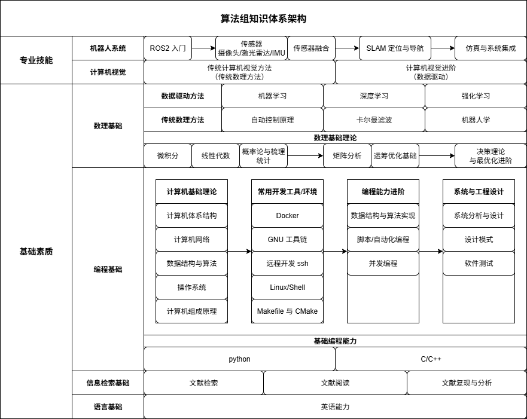

# 第一次培训

## 第一部分 知识体系介绍

算法组知识体系分为 **专业技能、数理基础、基础素质** 三大维度，覆盖从机器人系统到计算机视觉、从数学理论到编程实践的完整知识链。

---

  

---

## 一、专业技能维度

### 1. 计算机视觉方向

- **传统方法**：几何建模、图像处理、特征提取与匹配等。
- **数据驱动方法**：机器学习、深度学习、强化学习等。
- **核心目标**：理解视觉在 RoboMaster 中的应用场景，如装甲板识别与目标跟踪。

### 2. 机器人系统方向

- **学习路径**：
  ROS2 入门 → 传感器（相机/激光雷达/IMU） → 传感器融合 → SLAM 定位与导航 → 仿真与系统集成
- **核心目标**：掌握机器人从感知到定位再到整体系统搭建的流程。

---

## 二、数理基础维度

### 1. 数理基础理论

- 微积分、线性代数、概率统计
- 进阶：矩阵分析、运筹优化、决策理论与最优化等
- **作用**：为算法建模和推导提供数学工具。

### 2. 传统数理方法

- 自动控制原理、卡尔曼滤波、机器人学等
- **作用**：支撑 SLAM、运动预测等算法的理论基础。

### 3. 数据驱动方法

- 机器学习、深度学习、强化学习等
- **作用**：提供面向数据的算法设计思路。

---

## 三、基础素质维度

### 1. 编程基础

- **编程语言**：Python、C/C++
- **计算机基础理论**：体系结构、操作系统、计算机网络、数据结构与算法等
- **开发工具/环境**：Linux/Shell、Git、CMake、Docker、SSH 等
- **能力进阶**：并发编程、脚本自动化、设计模式、软件测试
- **作用**：保证能够高效开发和调试算法。

---

### 2. 信息检索基础

- 文献检索、文献阅读、文献复现与分析
- **作用**：提升学习和科研能力，能够快速追踪前沿算法。

### 3. 语言基础

- 英语能力
- **作用**：方便查阅国际前沿资料和开源文档。

---

## 第二部分 培训与招新流程

### Part 1 编程语言入门

培训第一部分旨在为同学们打牢计算机编程基础，系统掌握 Python、C 语言与 C++ 的核心概念与编程技能。通过循序渐进的教学安排，同学们将从理解基本语法、控制流与数据结构开始，逐步过渡到函数、类及面向对象设计，再进一步掌握项目工程化与常用编程工具链的使用。在理论讲解的基础上，培训结合实践小任务，如基于 Python 的弹球射击小游戏和基于 C 的控制台 Flappy Bird 游戏，确保同学们能够将所学知识应用于实际开发场景，为后续计算机视觉及高级编程课程奠定坚实基础。

---

| 周次 | Python | C语言 | C++ | 备注 |
|------|--------|------|-----|------|
| 1    | ███    |      |     | Python 环境 + 变量运算符 |
| 2    | ███    |      |     | 控制流、数据结构、函数、类、模块 |
| 3    |        | ███  |     | CMD、GCC、变量、数组、指针 |
| 4    |        | ███  |     | 结构体、typedef、Makefile、CMake |
| 5    |        | ███  |     | C语言实践任务：控制台 Flappy Bird |
| 6    |        |      | ███ | C++ 面向对象、引用与指针 |
| 7    |        |      | ███ | C++ 继承、封装、多态 |
| 8    |        |      | ███ | C++ 继承、封装、多态、标准容器 |

---

### Python（2周）

- **环境配置**
  - 安装 Python 及开发环境
- **基础知识**
  - 变量与运算符
  - 控制流（顺序、分支、循环）
  - 数据结构（列表、字典、集合等）
  - 函数
  - 类（面向对象基础）
  - 模块（import 及自定义模块）
- **实践任务**
  - 基于 `pygame` 编写弹球弹幕射击小游戏

---

### C语言（3周）

- **环境与工具**
  - CMD 命令行、GCC 工具链
- **基础知识**
  - 变量、运算符、控制流、函数
  - 数组
  - 指针
  - 结构体与 typedef
- **项目管理**
  - Makefile 与 CMake 及项目工程化
- **实践任务**
  - 基于 C 编写控制台版 Flappy Bird 游戏

---

### C++（3周）

- **面向对象**
  - 类与对象、继承、封装、多态
  - 引用与指针在类中的应用
- **数据结构**
  - C++ 标准容器（vector、map、set 等）
- **进阶（自学，可选）**
  - 运算符重载
  - 模板元编程

---

### Part 2 计算机视觉入门

第二部分培训旨在引导同学们初步掌握计算机视觉的基本原理与实践技能，重点围绕 OpenCV 工具库的应用展开。同学们将在 Python 和 C++ 环境中，系统学习图像的基本处理方法，包括色彩空间转换、阈值处理、形态学操作以及常用图形学操作等内容。通过理论讲解与动手实践相结合的方式，同学们能够理解图像处理的核心概念，并在编程环境中实现基本的视觉算法，为后续深度视觉任务及机器人感知模块的开发打下坚实基础。

---

### OpenCV 入门（1个月）

- 环境配置（python 与 C++）
- 色彩空间基础
- 基础形态学操作
- 阈值相关操作
- 常用图形学操作

【注】推荐大家通过 python 版本入门了解其基本使用方式，并同时熟悉 C++ 版本，入队考核要求使用 C++ 版本开发。

---

### Part 3 入队考核

- **准备时间**：1 个月
- **考核内容**：
  - Python 与 C++ 基础知识
  - OpenCV 应用能力
- **考核方式**：
  - 一个基于 OpenCV 的计算机视觉小项目

---

## 第三部分 常用软件及网络资源介绍

