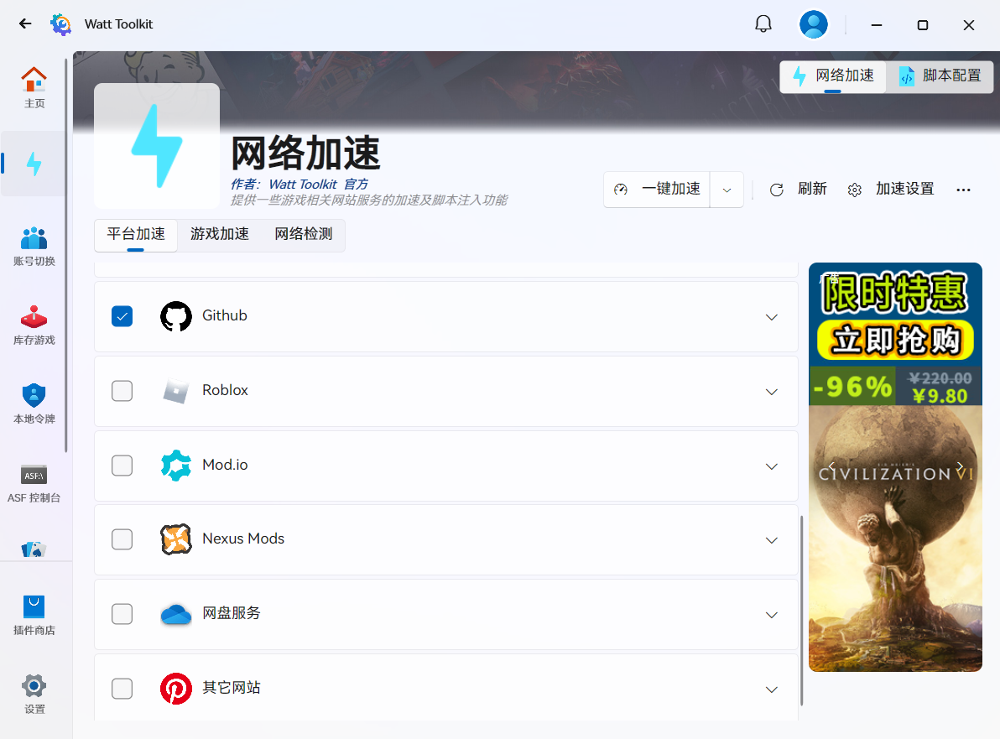
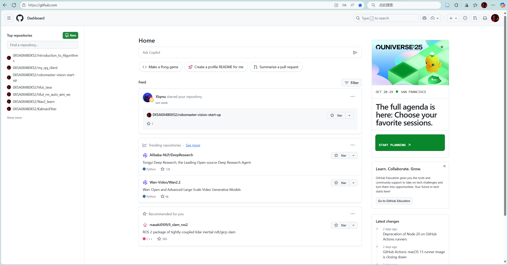
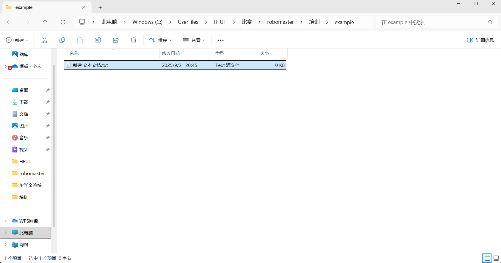
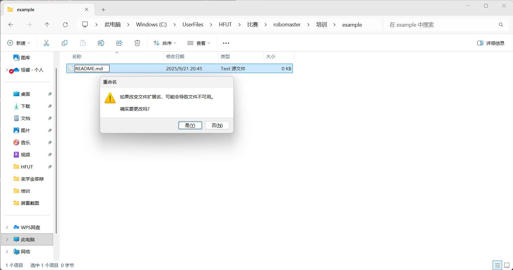
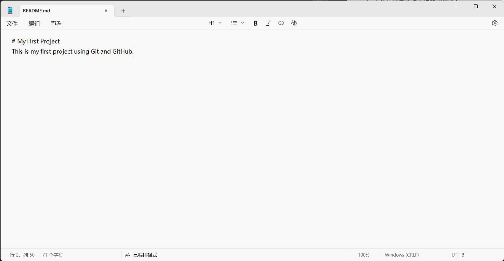
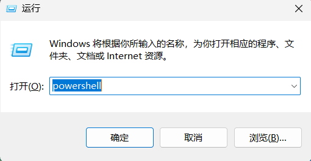
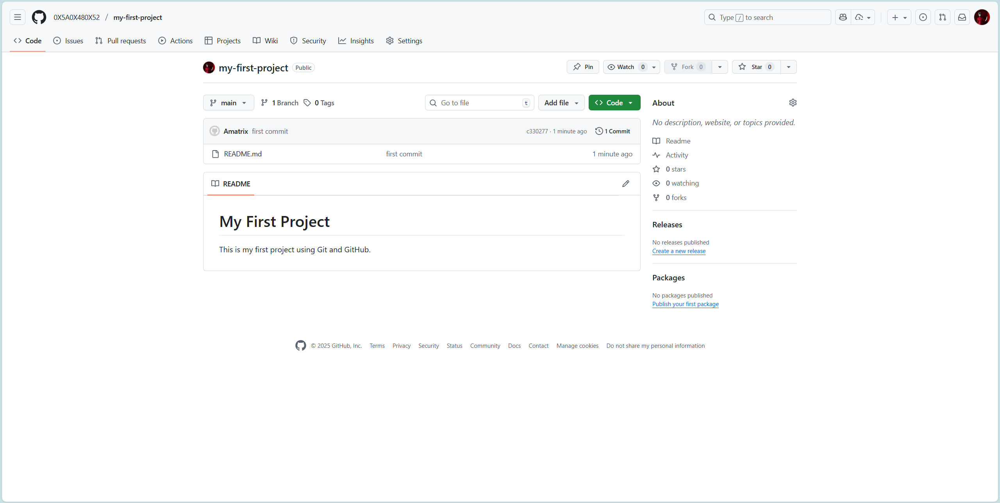

# 第一次培训课后小任务详细指引

## 🎯 学习目标

通过本任务，你将完成编程环境的基本搭建，掌握项目管理与代码版本控制的入门技能，并熟悉 GitHub 的使用方式。这将为后续编程学习与团队合作打下坚实基础。

---

## 一、必做任务

### 1. 下载并安装 Python

**背景说明**：Python 是目前最流行的编程语言之一，常用于数据分析、人工智能和 Web 开发。

**操作步骤**：

1. 访问 [Python 官网](https://www.python.org/downloads/)。
2. 点击下载最新稳定版本（建议选择 3.x）。
3. 安装时 勾选 `"Add Python to PATH"`，避免后续命令行无法识别。
4. 详细的安装教程可参考：
   - [Python的下载安装教程（很详细，初学者也能懂）](https://blog.csdn.net/weixin_43654123/article/details/121367803)
   - [python下载与安装教程（很详细）](https://zhuanlan.zhihu.com/p/690791352)
   - [黑马程序员python教程，8天python从入门到精通，学python看这套就够了](https://www.bilibili.com/video/BV1qW4y1a7fU/?p=4)
5. 安装完成后，在终端/命令提示符输入：

   ```bash
   python --version
   ```

   如果显示版本号（如 `Python 3.12.3`），说明安装成功。

- [ ] **完成标志**：能在命令行正确显示 Python 版本。

---

### 2. 配置一个 IDE

**背景说明**：IDE（集成开发环境）可以让你更高效地编写、调试和运行代码。推荐 **VS Code** 或 **PyCharm**。

**操作步骤（以 VS Code 为例）**：

1. 下载 [VS Code](https://code.visualstudio.com/)。
2. 打开 VS Code，进入 **扩展市场（Extensions）**，搜索并安装：
   - **VS Code 汉化插件**
   - **Python** 插件
   - **Pylance**（智能补全）
   - 具体如何安装请参考详细安装教程
3. 更多详细安装教程可参考：
   - [从零开始：VSCode的详细安装与配置教程](https://zhuanlan.zhihu.com/p/698865320)
   - [Python VScode 配置](https://www.runoob.com/python3/python-vscode-setup.html)
   - [Python安装与VSCode配置保姆级教程](https://blog.csdn.net/2401_82819685/article/details/146186751)
   - [VS Code 中的 Python 快速入门指南](https://vscode.js.cn/docs/python/python-quick-start)
4. 新建一个 `.py` 文件，输入：

   ```python
   print("Hello, World!")
   ```

   点击运行按钮，能输出结果说明配置成功。

**PyCharm** 的配置方法类似，具体可参考：

- [PyCharm安装与配置教程](https://www.runoob.com/pycharm/pycharm-install.html)
- [PyCharm安装教程及基本使用（更新至2024年新版本）](https://blog.csdn.net/qq_67344578/article/details/137737529)

PyCharm 和 VS Code 都是优秀的 Python 开发工具，选择适合自己的即可。

- [ ] **完成标志**：能在 IDE 中运行 Python 程序。

---

### 3. 注册 GitHub 账号

**背景说明**：GitHub 是全球最大的代码托管平台，用于存储和协作开发代码。

**操作步骤**：

1. 打开 [GitHub 官网](https://github.com)。
2. 点击 **Sign up**，填写邮箱、用户名和密码。
3. 验证邮箱后即可完成注册。
4. 登录后可以尝试浏览他人的开源项目。
5. 详细的注册流程可参考：
   - [GitHub注册账号](https://www.bilibili.com/video/BV1eE421M7Wr/)
   - [注册Github账号详细教程【超详细篇 适合新手入门】](https://blog.csdn.net/m0_75085583/article/details/145676885)
   - [2025版-Github账号注册详细过程](https://blog.csdn.net/m0_67906358/article/details/145818218)
   - [手把手教你注册Github账号](https://zhuanlan.zhihu.com/p/805391882)

**常见问题（中国大陆用户）**：
部分地区访问 GitHub 可能出现：

- 页面加载缓慢或无法打开。
- 注册验证码或邮件收不到。
- Push/Pull 速度很慢。

**原因解释**：

- GitHub 的服务器主要位于海外，中国大陆访问存在网络延迟。
- 某些运营商对 GitHub 域名解析不稳定。
- 邮件可能被邮箱服务商拦截。

**解决方案**：

1. **基础尝试**

   - 过一段时间再进行尝试
   - 切换不同网络（校园网、手机热点）。
   - 检查邮箱垃圾邮件文件夹。
   - 使用 Gmail、Outlook、163 邮箱等常见邮箱注册。

2. **加速器（推荐）**

   - 使用 VPN、加速器或代理访问 GitHub，能获得更稳定的体验。
   - 经过测试可用的加速器有：
     - **FastGithub**:
       - 可参考 [小工具推荐：FastGithub的下载及使用](https://blog.csdn.net/qq_43554335/article/details/134066165)
       - 下载请使用 [清华云盘](https://cloud.tsinghua.edu.cn/d/df482a15afb64dfeaff8/)，并下载电脑对应版本
     - **Watt Toolkit**：
       - [Watt Toolkit官网](https://steampp.net/) 下载并安装
       - 打开程序后在网络加速中旋转合适的结点加速： 

3. **国内替代方案（临时过渡）**

   - 如果实在无法连接 GitHub，可以使用国内的 **Gitee（码云）** 等注册并托管代码。
   - Gitee 在国内访问速度快，功能类似 GitHub，适合新手练习。
   - 但需要注意：**国际主流仍以 GitHub 为主**，未来团队合作、开源项目参与最好以 GitHub 为核心。

- [ ] **完成标志**：能正常注册并登录 GitHub（或 Gitee 等作为临时替代）。例如进入如下界面：

---

### 4. 下载并安装 Git

**背景说明**：Git 是一个分布式版本控制系统，用于追踪代码修改和团队协作。

**操作步骤**：

1. 访问 [Git 官网](https://git-scm.com/downloads)。
2. 下载并安装（Windows 用户可直接下一步到完成）。
3. 更多详细安装教程可参考：
   - [Git的安装与配置教程](https://www.runoob.com/git/git-install.html)
   - [Git下载安装教程：git安装步骤手把手图文【超详细】](https://zhuanlan.zhihu.com/p/443527549)
   - [Git安装教程 2025最新版详细图文安装教程（超详细）](https://blog.csdn.net/deltadev/article/details/148623341)
   - [在Windows上安装Git](https://www.bilibili.com/video/BV1vM4m1Q7hC/)
   - [【大学生扫盲课】1 Git、GitHub 和 Gitee 完整讲解：从基础到进阶功能](https://www.bilibili.com/video/BV1G8CFYvEjt/)
4. 打开命令行，输入：

   ```bash
   git --version
   ```

   若能输出版本号（如 `git version 2.44.0`），说明安装成功。

- [ ] **完成标志**：能在命令行正确显示 Git 版本。

---

### 5. 创建一个本地项目并添加 README.md

**操作步骤**：

1. 在电脑上新建一个文件夹，例如 `my-first-project`。
2. 进入文件夹，打开编辑器（如 VS Code）。
3. 新建文件 `README.md`，写入：

   ```markdown
   # My First Project
   This is my first project using Git and GitHub.
   ```

4. 或者在文件资源管理器中操作：
   - 右键新建文本文件：
   - 将文件名改为 `README.md`。注意  `README.md` 是包含文件扩展名的！ 
   - 这里将扩展名为 `.txt` 的文件改为 `.md`，如果出现了上述警告，请选择“确认”。
   - 可使用记事本编辑文件内容。但更推荐使用 VS Code 等 IDE 编辑。
5. 保存文件。

- [ ] **完成标志**：项目文件夹下有 `README.md` 文件。

---

### 5.5 PowerShell / CMD 命令行使用

**背景说明**：Git 的大多数操作都在命令行中完成。熟悉基本命令可以帮助你更高效地管理项目。

【注】这里仅以 Windows 系统为例，Mac 用户操作类似，

**启动 PowerShell / CMD**：

- Windows 用户可以在开始菜单搜索 `PowerShell` 或 `CMD`，点击打开。
- 或在键盘上按 `Win + R`，输入 `powershell` 或 `cmd`，回车打开。

**常用命令**：

1. **进入文件夹**

   ```powershell
   cd 路径\my-first-project
   ```

   - `cd` = change directory，切换到指定目录。
   - 示例：

     ```powershell
     cd C:\Users\你的用户名\Documents\my-first-project
     ```

2. **查看当前目录文件**：

   - PowerShell：

     ```powershell
     ls
     ```

   - CMD：

     ```cmd
     dir
     ```

3. **返回上一级目录**

   ```powershell
   cd ..
   ```

4. **清屏**

   ```powershell
   cls
   ```

5. **查看当前路径**

   ```powershell
   pwd
   ```

   （在 CMD 里使用 `cd` 也能显示当前路径）

**小练习**：

1. 打开 PowerShell / CMD，尝试切换到 `my-first-project` 文件夹。
2. 用 `ls` 或 `dir` 查看文件，确认 `README.md` 已存在。

- [ ] **完成标志**：能够独立使用命令行进入项目目录，并列出文件。

---

### 6. 使用 Git 将项目提交到 GitHub

**操作步骤**：

1. 在命令行进入项目文件夹：

   ```bash
   cd 路径/my-first-project
   ```

2. 初始化本地仓库：

   ```bash
   git init
   ```

3. 添加文件并提交：

   ```bash
   git add .
   git commit -m "first commit"
   ```

4. 在 GitHub 网站 **新建一个仓库**（Repository），命名 `my-first-project`。
5. 在命令行绑定远程仓库并推送：

   ```bash
   git remote add origin https://github.com/你的用户名/my-first-project.git
   git branch -M main
   git push -u origin main
   ```

6. 刷新 GitHub 仓库页面，能看到你的 `README.md`。
7. 更多操作请参考：
   - [git 提交本地到远程仓库——超详细](https://blog.csdn.net/weixin_42312323/article/details/107407674)
   - [Git代码上传完整指南：从本地修改到远程仓库推送](https://blog.csdn.net/2201_75436433/article/details/151753099)
   - [本地项目推送到远程仓库gitHub上（超详细）](https://zhuanlan.zhihu.com/p/90168946)
   - [【GeekHour】一小时Git教程](https://www.bilibili.com/video/BV1HM411377j/)

- [ ] **完成标志**：GitHub 仓库显示 `README.md`，并有提交记录。例如：

---

## 二、拓展任务

### 1. 申请 GitHub Student Developer Pack

**背景说明**：这是 GitHub 为学生提供的免费资源包，包含数十种开发工具的学生优惠。

**操作步骤**：

1. 打开 [申请页面](https://education.github.com/pack)。
2. 使用学校邮箱注册（推荐），并上传学生证明（学生证或录取通知书）。
3. 等待审核（一般 3-7 天）。
4. 更多详细信息请参考 [GitHub Student Developer Pack](https://education.github.com/pack) 页面和 [Github学生认证及学生包保姆级申请指南](https://zhuanlan.zhihu.com/p/578964972)。

- [ ] **完成标志**：GitHub 账号显示 **Student Developer Pack** 授权。

---

### 2. 尝试使用 Copilot

**背景说明**：GitHub Copilot 是一个 AI 编程助手，能根据注释或代码上下文自动补全。

【注】后续学习语言时请将 Copilot 自动补全功能**关闭**，以免影响学习效果。

**操作步骤**：

1. 在 VS Code 中打开 **扩展市场**，搜索并安装 **GitHub Copilot**。
2. 使用 GitHub 账号登录并激活 Copilot。
3. 在 `.py` 文件中输入：

   ```python
   # 写一个函数，计算斐波那契数列
   ```

   等待 Copilot 自动补全函数。

- [ ] **完成标志**：能看到 Copilot 自动生成的代码，并运行成功。

---

## 三、总结

完成以上任务后，你将具备以下能力：

- 能独立搭建 Python 编程环境。
- 掌握 Git 和 GitHub 的基本操作。
- 初步体验 AI 编程助手和学生优惠资源。

这份文档可作为 **学习路线的第一步**，后续可以在此基础上逐渐过渡到更复杂的项目开发。
