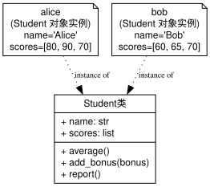

# 第三次培训：Python 面向对象与库简介

## 🎯 培训目标

- 了解 **面向对象编程（OOP）** 思想  
- 学会使用 Python **类（class）与对象（object）**  
- 了解 **封装、继承、多态** 三大核心特性  
- 了解 Python **标准库** 与 **第三方库**  
- 基于 OOP 优化上次的成绩管理系统  

---

## 一、回顾：上次的成绩管理系统（过程式）

```python
name = input("请输入学生姓名: ")
scores_input = input("请输入成绩（空格分隔）: ")
scores = [int(x) for x in scores_input.split()]
average = sum(scores) / len(scores)
print(name, "平均分:", average)
```

➡️ 这是典型的 **面向过程** 程序：按步骤执行。

---

## ⚠️ 面向过程的问题

1. **数据与逻辑分离**

   - 成绩、姓名、平均分是独立变量
2. **可扩展性差**

   - 想新增功能要改很多地方
3. **难以复用**

   - 无法轻易表示多个学生

> 👉 本质问题：**数据和操作没有被封装（封装的程度不够）。**

---

## 二、引入面向对象思想（OOP）

**核心思路：**

> 把“学生”和“成绩”抽象为“**对象**”，
> 把操作这些对象的功能封装成“**方法**”。

### 💡 面向对象 vs 面向过程

| 思路   | 代码组织方式       | 优点      |
| ---- | ------------ | ------- |
| 面向过程 | 按步骤写逻辑（函数驱动） | 简单直观    |
| 面向对象 | 按“对象”组织（类驱动） | 易扩展、易维护 |

---

### 类与对象示例

<!--  -->



<!-- ```dot
digraph StudentOOP {
  rankdir=TB;
  node [fontname="Helvetica", fontsize=12];

  // 定义类
  Student [shape=record, label="{Student类 |+ name: str\l+ scores: list\l|+ average()\l+ add_bonus(bonus)\l+ report()\l}"];

  // 定义实例对象
  alice [shape=note, label="alice\n(Student 对象实例)\nname='Alice'\nscores=[80, 90, 70]"];
  bob   [shape=note, label="bob\n(Student 对象实例)\nname='Bob'\nscores=[60, 65, 70]"];

  // 关系：对象由类实例化而来
  alice -> Student [style=dotted, label="instance of", fontsize=10];
  bob   -> Student [style=dotted, label="instance of", fontsize=10];
}
``` -->

假设我们现在有两个学生 `Alice` 和 `Bob`：他们都有姓名和成绩，并且可以计算平均分和加分。可以**抽象**出一个 `Student` 类，用于表示**抽象概念**“学生”。并将 `Alice` 和 `Bob` 作为 `Student` 类的两个对象实例。

---

## 三、Python 中的类与对象

```python
class Student:
    def __init__(self, name, scores):
        self.name = name
        self.scores = scores

    def average(self):
        return sum(self.scores) / len(self.scores)
```

- `__init__()` 是构造方法
- `self` 代表对象自身
- 类的方法用于操作对象的数据

---

## 🔍 创建对象

```python
alice = Student("Alice", [80, 90, 70, 85])
print(alice.name)
print(alice.average())
```

输出：

``` python
Alice
81.25
```

> 类是“模板”，对象是“实例”。

---

## 四、OOP 版成绩管理系统

```python
class Student:
    def __init__(self, name, scores):
        self.name = name
        self.scores = scores

    def average(self):
        return sum(self.scores) / len(self.scores)

    def add_bonus(self, bonus):
        self.scores = [s + bonus for s in self.scores]

    def report(self):
        print(f"{self.name} 的平均分: {self.average():.1f}")
        print(f"成绩列表: {self.scores}")
```

---

## ▶️ 示例运行

```python
alice = Student("Alice", [80, 90, 70])
bob = Student("Bob", [60, 65, 70])

alice.report()
bob.add_bonus(5)
bob.report()
```

输出：

```bash
Alice 的平均分: 80.0
成绩列表: [80, 90, 70]
Bob 的平均分: 68.3
成绩列表: [65, 70, 75]
```

---

<!--  -->


<!-- ```dot
digraph StudentOOP {
  rankdir=TB;
  node [fontname="Helvetica", fontsize=12];

  // 定义类
  Student [shape=record, label="{Student类 |+ name: str\l+ scores: list\l|+ average()\l+ add_bonus(bonus)\l+ report()\l}"];

  // 定义实例对象
  alice [shape=note, label="alice\n(Student 对象实例)\nname='Alice'\nscores=[80, 90, 70]"];
  bob   [shape=note, label="bob\n(Student 对象实例)\nname='Bob'\nscores=[60, 65, 70]"];

  // 关系：对象由类实例化而来
  alice -> Student [style=dotted, label="instance of", fontsize=10];
  bob   -> Student [style=dotted, label="instance of", fontsize=10];
}
``` -->

- `Student` 是类（蓝图），定义了数据结构（`name`、`scores`）和行为（`average()`、`add_bonus()`、`report()`）。
- `alice` 与 `bob` 是 `Student` 的两个对象实例。
- 每个对象都有自己独立的属性数据（如不同的 `name`、`scores`）。
- 对象可以调用类中定义的方法（如 `alice.average()`）

---

## 五、OOP 三大特性

| 特性 | 含义        | 示例                        |
| -- | --------- | ------------------------- |
| **封装** | 数据与方法放入类中 | `self.name`, `average()`  |
| **继承** | 新类复用父类代码  | `class Graduate(Student)` |
| **多态** | 同名方法不同表现  | `report()` 自定义            |

> 目前我们重点掌握**封装**，**继承**和**多态**将在后续 `C++` 部分中会进行详细讲解。

---

## 六、对比总结

| 方面  | 面向过程 | 面向对象 |
| --- | ---- | ---- |
| 数据  | 独立变量 | 对象属性 |
| 函数  | 全局函数 | 类方法  |
| 扩展  | 修改逻辑 | 新建子类 |
| 可读性 | 难维护  | 清晰结构 |

> 面向对象更像是在搭积木，灵活、清晰、可扩展。

---

## 七、Python 标准库简介

Python 自带大量标准库，功能丰富：

| 功能   | 库名                         | 示例      |
| ---- | -------------------------- | ------- |
| 系统操作 | `os`, `sys`, `pathlib`     | 文件操作    |
| 时间日期 | `datetime`, `time`         | 时间格式化   |
| 数学计算 | `math`, `random`           | 数学与随机   |
| 数据结构 | `collections`, `itertools` | 计数器     |
| 文件格式 | `csv`, `json`              | 数据读写    |
| 网络请求 | `urllib`, `http`           | HTTP 请求 |

---

## 示例：`datetime`

```python
from datetime import datetime

now = datetime.now()
print("当前时间:", now.strftime("%Y-%m-%d %H:%M:%S"))
```

输出：

```bash
当前时间: 2025-10-10 15:45:00
```

---

## 八、第三方库简介

通过 `pip install` 安装社区维护的扩展库：

| 领域   | 库名                      | 功能      |
| ---- | ----------------------- | ------- |
| 数据分析 | `pandas`, `numpy`       | 数据处理    |
| 可视化  | `matplotlib`, `seaborn` | 绘图      |
| 网络请求 | `requests`              | HTTP 请求 |
| Web  | `flask`, `django`       | 网站开发    |
| AI   | `pytorch`, `tensorflow`   | 机器学习    |
| 游戏   | `pygame`                | 游戏开发    |

---

## 任务描述（Task）

- **输入**：一份 CSV 文件 `grades.csv`，字段如下：
  `学年学期,课程名称,课程代码,教学班代码,学分,绩点,成绩,成绩明细,是否为公选课`
- **示例行**（示例含四门课部分数据）：

| 课程名称 | 课程代码 | 学分 | 绩点 | 成绩 |
|---------|---------|-----|-----|-----|
| 跨文化视野下中国人的情感世界 | 1500052X | 1.0 | 3.3 | 83 |
| 最优化原理 | 1110372B | 2.0 | 3.3 | 83 |
| 管理信息系统 | 1110350X | 2.0 | 3.7 | 86 |
| 大学体育(4) | 5100171B | 0.5 | 3.7 | 86 |

---

- **目标**：
  1. 计算 **学分加权平均绩点**：
    $$ \text{加权平均绩点} = \frac{\sum (\text{绩点}_i \times \text{学分}_i)}{\sum \text{学分}_i} $$
  2. 计算 **学分加权平均成绩**：
    $$ \text{加权平均成绩} = \frac{\sum (\text{成绩}_i \times \text{学分}_i)}{\sum \text{学分}_i} $$
- **额外需求（可选）**：
  - 显示每门课对加权值的贡献（绩点×学分、成绩×学分）
  - 忽略缺失或无法转换为数值的行，处理学分为 0 或空的情况

---

## 使用的库与方法

- **pandas**
  - **Python 的数据分析库**
  - 提供类似 Excel 的 **表格数据结构** 和 **操作方法**
  - 常用于数据清洗、统计分析、可视化前的处理
- **为何用 pandas?**
  - 📈 **高效**：一次操作可处理上万行数据  
  - 🧮 **简洁**：几行代码即可完成统计分析  
  - 💾 **兼容性强**：支持 `CSV`、`Excel`、`SQL`、`JSON` 等格式  
  - 🧰 **广泛使用**：是数据科学、机器学习的基础库之一  

---

## 示例：使用 `pandas` 计算加权平均绩点与成绩

```python
import pandas as pd

# 模拟读取成绩文件（假设文件名为 "grades.csv"）
df = pd.read_csv("grades.csv")

# 计算总学分
total_credit = df["学分"].sum()

# 计算加权平均绩点与加权平均成绩
weighted_gpa = (df["绩点"] * df["学分"]).sum() / total_credit
weighted_score = (df["成绩"] * df["学分"]).sum() / total_credit

print(f"加权平均绩点: {weighted_gpa:.2f}")
print(f"加权平均成绩: {weighted_score:.2f}")
```

---

### 输出示例

```bash
PS > python demo02.py
总学分: 105.5
加权平均绩点: 3.83
加权平均成绩: 89.42

每门课程贡献（部分列展示）：
          课程名称  学分  绩点  成绩  绩点×学分  成绩×学分
跨文化视野下中国人的情感世界 1.0 3.3  83   3.30   83.0
         最优化原理 2.0 3.3  83   6.60  166.0
        管理信息系统 2.0 3.7  86   7.40  172.0
       大学体育（4） 0.5 3.7  86   1.85   43.0
      机械设计基础 B 3.0 4.3  95  12.90  285.0
```

**更多功能**：能否仅计算**某学期课程**？能否仅计算**非公选课**的成绩？

---

## 九、总结与展望

| 收获        | 说明        |
| --------- | --------- |
| 了解 OOP 思想 | 用类和对象组织程序 |
| 掌握三大特性    | 封装、继承、多态  |
| 学会用库      | 快速构建功能    |
| 下次主题      | `C` 语言基础 |

---

## 💬 课后练习

1️⃣ 在 `Student` 类中新增：

- `get_highest_score()`
- `is_pass()` 方法

2️⃣ 创建 `Classroom` 类

- 存多个学生对象
- 计算全班平均分

3️⃣ 使用 `json` 库保存学生数据到文件并读取

---

## 🎉 感谢聆听

- 任何问题欢迎在群里随时提问！
- 课后练习**可选**完成，**不强求**，欢迎交流讨论~
