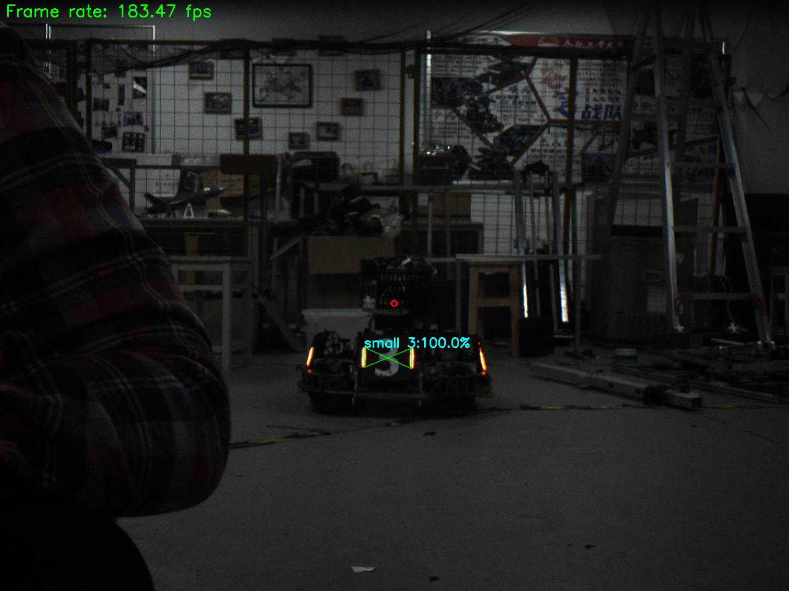
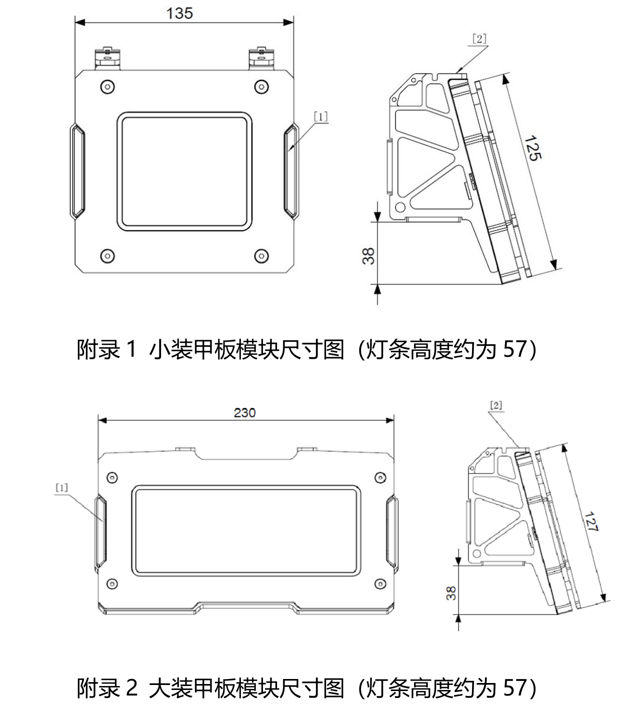

# 🎯 **算法组培训终期考核规则**

## 自动瞄准：装甲板识别 + 数字识别

> version 0.2

## 一、考核目的

本次终期考核旨在检验同学们在培训阶段对于**编程能力、工程组织能力、文档编写、代码规范性以及 Git 使用习惯**的掌握情况。

考核采用**项目制**形式，要求同学们基于 OpenCV 完成一套“自动瞄准”任务（装甲板识别 + 数字编号识别），并在 GitHub 上开源提交。本次考核占总成绩的 **40~60%**，具体的权重将在最终评分时确定。

本次考核聚焦于工程化落地与可运行的算法管线：在规定时间内完成可构建、可运行、可演示的项目。

---

## 二、提交内容与方式

### **1. 提交内容**

每位同学必须提交：

- **一个 C++ 工程化项目（主项目）：自动瞄准（装甲板灯条匹配 + 数字识别）**
- GitHub 项目链接（公开仓库）
- 项目构建与运行方式需在 README 中明确说明

建议一并提供：

- 演示视频链接（需包含姓名、编译与运行过程、运行效果展示）

可额外提交其他项目（不限语言，不限形式），但仅作为附加展示，不计入主项目评分。

> **额外项目**可以是 Python 脚本、Java 程序、Web 应用等任何形式的项目，例如自己之前实现的小组项目或课程实验，也可以是学习语言或其他技术的笔记仓库。鼓励同学们根据个人兴趣与特长进行创作。
> 尽管**额外项目**不计入评分，但建议同学们积极尝试不同方向与技术栈，丰富个人项目经验。对额外项目的良好实践也会在后续考核中作为加分项考虑。

### **2. 提交方式**

- 将 GitHub 仓库链接通过指定 QQ 群内收集表提交
- 截止时间：**以群内通知为准**

---

## 三、主项目硬性要求（C++ 工程项目）

本项目要求所有同学**必须使用 C++ 进行工程化项目开发，并体现工程思维、模块化设计与可维护性**。以下为必须满足的要求。

---

### 0. 项目实现内容（终期任务，必须完成）

在规定时间内，基于 OpenCV（C++），编写一套自动瞄准算法，实现对装甲板的识别与数字编号的识别。

#### 0.1 基本功能要求

1. 能够识别出装甲板灯条，并能够正确地将成对的灯条进行匹配（灯条和装甲板参数见附录/训练材料）。
2. 能够识别出装甲板中央贴纸的数字并标记出来（可能出现的编号为 1、2、3、4、7）。
3. 输出应具备“可观测结果”：至少包含灯条检测/装甲板框选/数字识别结果的可视化标注（窗口显示或保存视频均可）。
4. 如果实现了以上基本内容，还可以尝试：
   - 基于灯条的几何关系判断是大装甲还是小装甲（加分项，见下文）。
   - 基于 PnP 实现目标测距与位姿估计（加分项，见下文）。
   - 引入特征提取与匹配提升装甲板匹配稳定性（加分项，见下文）。
   - 实现目标跟踪与运动预测（加分项，见下文）。
5. 程序必须稳定运行，不得出现未处理的崩溃。
6. 在实现上述功能的基础上，需满足 C++ 工程项目的各项要求（见下文）。
7. 最终效果示例（仅供参考）：



#### 0.2 说明（与验收一致）

1. 对于基本要求 1：灯条会有两种颜色，不要求程序能够自主识别颜色；但要求能够通过参数/配置指定敌方颜色（例如 `--enemy_color=red|blue`）。
2. 对于基本要求 2：本次考核不强求高准确性，但需要能跑通流程并输出结果。当然，准确率越高越好。
3. 对于演示视频：如果上传，视频中需透露姓名与编译运行过程。
4. 对于代码测试：验收会提供多段测试视频：`test1.mp4`（基础）、`test2.mp4`（较为缓和的赛场内录，己方为蓝方）、`test3.mp4`（较为混乱的赛场内录，己方为红方）。
5. 对于原创性：允许参考资料与开源实现，但终期验收将进行答辩；请确保理解并能讲清楚自己的代码与设计。

---

### 1. C++ 语言要求（必须体现 OOP）

你的项目必须满足：

#### ✔ 至少包含 **两个以上的类（Class）**

要求：

- 类不能只是空壳，需要有方法（public/private 成员函数）
- 至少一个类需要具有内部状态（成员变量）

示例类结构（示意）：

```cpp
class LightBarDetector {
public:
    LightBarDetector();
    std::vector<cv::RotatedRect> detect(const cv::Mat& frame);
private:
    int binaryThreshold;
};
```

#### ✔ 至少具有一种类之间的关系

包括但不限于：

- **继承（Inheritance）**
- **组合（Composition）**
- **聚合（Aggregation）**

示例（组合）：

```cpp
class AutoAimApp {
private:
    LightBarDetector detector; // AutoAimApp 组合了 LightBarDetector
    ArmorMatcher matcher;
    NumberRecognizer recognizer;
};
```

#### ✔ 不允许只写一个 main.cpp 把所有逻辑堆进去

你的项目必须按模块拆分，例如：

```bash
src/
│── main.cpp
│── light_bar_detector.cpp
│── armor_matcher.cpp
│── number_recognizer.cpp
include/
│── light_bar_detector.h
│── armor_matcher.h
│── number_recognizer.h
```

一个合理的 C++ 项目应该做到：

- main.cpp 只负责组织模块流程
- 主要逻辑封装在类中
- 头文件放声明，cpp 放实现

---

### 2. 必须使用 CMake 组织项目（工程化构建）

项目根目录必须包含：

```bash
CMakeLists.txt
src/
include/
```

最基本要求的 CMake 结构如下：

```bash
project_name/
│── CMakeLists.txt
│── src/
│     ├── main.cpp
│     └── module1.cpp
│── include/
       └── module1.h
```

#### ✔ CMake 必须实现以下能力

##### 2.1 可以编译出可执行程序

例如：

```cmake
add_executable(main
    src/main.cpp
    src/tokenizer.cpp
    src/parser.cpp
)
target_include_directories(main PUBLIC include)
```

##### 2.2 杜绝“直接把所有文件写死在 main 里”

##### 2.3 若有组件/库，可拆分为 target（推荐）

```cmake
add_library(core
    src/tokenizer.cpp
    src/parser.cpp
)
target_include_directories(core PUBLIC include)

add_executable(app src/main.cpp)
target_link_libraries(app core)
```

---

### 3. 项目结构（必须清晰、有模块化）

主项目必须包含清晰的目录结构，至少包括：

```bash
project/
│── CMakeLists.txt
│── README.md
├── include/
│   └── *.h
├── src/
│   └── *.cpp
```

推荐可选结构：

```bash
├── tests/         # 单元测试
├── docs/          # 文档（如设计说明）
├── examples/      # 示例代码
```

目录结构应体现模块化，例如：

```bash
src/
│── core/
│   ├── tokenizer.cpp
│   ├── parser.cpp
│── utils/
│   └── logger.cpp
```

禁止：

- 文件全部堆在 src/ 下无分类
- 单个文件超过几百行的大杂烩代码

---

### 4. 文档要求（README + 注释）

#### ✔ README.md 必须包含以下内容

1. **项目简介**（这个项目是什么？解决什么问题？）
2. **主要功能说明**
3. **项目目录结构解释**
4. **构建方式与运行方式**
   示例：

   ```bash
   mkdir build
   cd build
   cmake ..
   make
   ./app
   ```

5. （可选）模块设计说明

#### ✔ 注释要求

- 主要类、公共接口必须写注释
- 内容解释逻辑或功能，而不是重复代码
- 不要求注释每一行，但逻辑块或函数必须有说明

示例注释：

```cpp
// Parse tokens into an AST-like structure
Node Parser::parse(const std::vector<std::string>& tokens) {
    ...
}
```

---

### 5. Git 提交记录要求（必须具有开发过程）

要求：

#### ✔ 不允许一次性提交所有代码

需要至少 **5 条以上有效提交**，例如：

- 初始化项目结构
- 添加某个模块
- 修复 Bug
- 重构
- 文档更新

#### ✔ 提交信息必须清晰

推荐格式：

```bash
feat: add tokenizer class #添加新的实现
fix: resolve crash on empty input #修复 Bug
refactor: extract config loader into its own module #重构代码
docs: update README with build steps #更新文档
```

#### ✔ 提交内容必须与 message 对应

不能出现：

```bash
feat: add new module
（实际上改了20个文件，含各类改动）
```

提交应尽可能做到**单一职责**。

---

### 6. 项目必须能成功构建 + 能运行

无论项目内容是什么：

- make 后必须成功编译
- 运行后不得出现未处理的崩溃
- 必须有可观测结果（程序打印/文件输出/简单交互均可）

示例输出方式：

- 命令行输出
- 日志文件
- 生成结果文件

---

### 7. 项目内容限定（必须为自动瞄准任务）

本次终期考核主项目的“实现内容”限定为自动瞄准相关任务：

- 输入：视频文件（验收提供的 `test1.mp4`/`test2.mp4`/`test3.mp4`）或摄像头（可选）。
- 处理：灯条检测 → 灯条配对/装甲板生成 → 数字识别（1/2/3/4/7）。
- 输出：可视化标注（至少包含灯条/装甲板框与识别数字），并保证程序稳定运行。

---

## 四、C++ 工程项目评分细则表

> **评分总分：100 分（OpenCV 视觉算法实现 60 分 + C++ 工程能力 40 分）**
> 另设加分项，最高 +10 分

---

### **一、OpenCV 自动瞄准功能实现（60 分）【核心】**

> 重点考察：
> **是否真正完成了“灯条 → 装甲板 → 数字识别 → 可视化输出”的完整视觉链路**

#### **1. 灯条检测与特征提取（20 分）**

| 评分项                      | 分值 | 评分标准                                       |
| ------------------------ | -- | ------------------------------------------ |
| **灯条二值化与预处理**            | 5  | 0：未实现；<br>3：简单阈值；<br>5：合理使用颜色通道 / 灰度 / 形态学 |
| **灯条轮廓提取与筛选**            | 5  | 0：无筛选；<br>3：仅面积筛选；<br>5：结合长宽比、角度、面积等几何特征   |
| **RotatedRect / 几何描述使用** | 5  | 0：无；<br>3：部分使用；<br>5：合理使用旋转矩形描述灯条          |
| **鲁棒性与参数可调性**            | 5  | 0：极不稳定；<br>3：可在单视频运行；<br>5：可通过参数适配不同场景     |

**小计：20 分**

#### **2. 灯条配对与装甲板生成（20 分）**

| 评分项           | 分值 | 评分标准                                          |
| ------------- | -- | --------------------------------------------- |
| **灯条配对逻辑正确性** | 8  | 0：未实现；<br>4：简单两两配对；<br>8：考虑角度差、高度差、距离比等约束     |
| **装甲板几何建模**   | 6  | 0：无；<br>3：简单矩形；<br>6：基于灯条生成 RotatedRect / ROI |
| **异常情况处理**    | 6  | 0：易崩溃；<br>3：部分过滤；<br>6：能处理干扰、误检、缺失情况          |

**小计：20 分**

#### **3. 数字区域提取与识别（15 分）**

| 评分项            | 分值 | 评分标准                                     |
| -------------- | -- | ---------------------------------------- |
| **数字 ROI 提取**  | 5  | 0：无；<br>3：固定裁剪；<br>5：基于装甲板自适应提取          |
| **数字识别方法**     | 5  | 0：无；<br>3：模板/简单分类；<br>5：CNN / SVM / 清晰流程 |
| **流程完整性（能跑通）** | 5  | 0：无法运行；<br>3：偶尔识别；<br>5：稳定输出 1/2/3/4/7   |

> ⚠️ **不强制高准确率，重在流程完整与可解释**

**小计：15 分**

#### **4. 可视化与结果输出（5 分）**

| 评分项            | 分值 | 评分标准                             |
| -------------- | -- | -------------------------------- |
| **检测结果可视化**    | 3  | 0：无；<br>1：仅框；<br>3：灯条 + 装甲板 + 数字 |
| **程序稳定性与演示效果** | 2  | 0：崩溃；<br>1：偶发问题；<br>2：稳定运行       |

**小计：5 分**

####  OpenCV 自动瞄准实现总分：**60 分**

---

### **二、C++ 工程能力与工程化实践（40 分）**

> 以下内容作为**工程基础能力支撑项**

#### **1. C++ 与 OOP 设计能力（15 分）**

| 评分项            | 分值 | 评分标准                                                     |
| -------------- | -- | -------------------------------------------------------- |
| **类数量与职责划分**   | 5  | 0：无类；<br>3：简单封装；<br>5：Detector / Matcher / Recognizer 清晰 |
| **类关系（组合/继承）** | 5  | 0：无；<br>3：简单组合；<br>5：结构合理、职责清晰                           |
| **接口设计与解耦**    | 5  | 0：混乱；<br>3：基本可用；<br>5：接口清晰，便于替换算法                        |

**小计：15 分**

#### **2. 工程结构与 CMake（10 分）**

| 评分项             | 分值 | 评分标准                                  |
| --------------- | -- | ------------------------------------- |
| **CMake 构建规范性** | 5  | 0：失败；<br>3：能编译；<br>5：target 清晰        |
| **目录结构与模块化**    | 5  | 0：单文件；<br>3：简单拆分；<br>5：src/include 分明 |

**小计：10 分**

#### **3. 文档与代码注释（10 分）**

| 评分项            | 分值 | 评分标准                                |
| -------------- | -- | ----------------------------------- |
| **README 完整度** | 5  | 0：无；<br>3：基本说明；<br>5：结构 + 构建 + 使用齐全 |
| **代码注释质量**     | 5  | 0：无；<br>3：少量；<br>5：关键类与逻辑清晰         |

**小计：10 分**

#### **4. Git 提交与版本管理（5 分）**

| 评分项         | 分值 | 评分标准                         |
| ----------- | -- | ---------------------------- |
| **提交次数与粒度** | 3  | 0：一次性；<br>2：3~5 次；<br>3：≥5 次 |
| **提交信息规范性** | 2  | 0：混乱；<br>1：一般；<br>2：清晰规范     |

**小计：5 分**

#### 工程能力与工程化实践总分：**40 分**

---

### **三、加分项（最多 +10 分）**

| 加分项                   | 分值 | 说明                                                    |
| --------------------- | -- | ----------------------------------------------------- |
| **基于 PnP 的目标测距与位姿估计** | +4 | 利用装甲板几何先验，结合 `solvePnP` 实现目标三维位置或距离估计，并能在画面或日志中输出结果   |
| **特征提取与匹配用于稳定性增强**    | +2 | 引入角点、边缘或特征描述子（如 ORB / FAST / 自定义特征）对装甲板进行辅助匹配或跨帧一致性约束 |
| **目标跟踪与运动预测（滤波）**     | +2 | 使用 Kalman Filter / α–β 滤波等方法，对装甲板中心或位姿进行跟踪与短时预测       |
| **大装甲/小装甲区分**        | +2 | 例如基于灯条间距与装甲板尺寸等方式区分大装甲与小装甲，并在输出中标注区分结果（大小装甲板参数详见附录）               |

**小计：最多 +10 分**

---

### 最终评分结构总结

| 模块                  | 分值        |
| ------------------- | --------- |
| **OpenCV 自动瞄准功能实现** | **60 分**  |
| **C++ 工程能力与工程化**    | **40 分**  |
| **加分项**             | **+10 分** |
| **最高总分**            | **110 分** |

## 五、其他说明

1. 如果 github 仓库因某些原因无法使用，也可以使用 GitLab、Gitee 等其他公开代码托管平台提交，但请确保链接**可访问**。如果无法访问，将视为未提交。
2. 本考核主要检验工程能力，不以项目大小为主要评价依据。
3. 多次提交不同项目仅其中一个 C++ 工程作为主项目评分（在提交的收集表中需要选为主项目），其他项目仅作展示。尽管其他项目不会计入评分，但良好实践会作为后续入队考核的加分项考虑。
4. 可参考开源项目，但必须**自行实现主要功能**的代码。
5. 鼓励大家通过**第三方库**提升项目质量，但请务必在 README 中注明所使用的第三方库及其用途。
6. 不反对大家借助 ChatGPT 等工具辅助编程，但请务必理解代码逻辑，确保代码质量。
7. 在最终的入队考核中，将会要求大家对该项目进行讲解与答辩，请务必熟悉自己提交的代码。如果无法回答相关问题，可能怀疑代码非本人编写，成绩将**按 0 分计算**。
8. 允许使用第三方库提升质量（如 OpenCV DNN/ONNXRuntime 等），但需在 README 中注明用途与依赖。在实现了基于 OpenCV 的基本功能后，也可尝试集成深度学习模型（如 YOLO、Transformer 等）提升准确率。如果没有基于 OpenCV 实现相关功能，**将按 0 分计算**，因为不符合考核要求。
9. 如有任何疑问，请及时在 QQ 群中提问或联系培训负责人。
10. 后续如有规则更新或修改，将会在 QQ 群中通知，请大家保持关注。

> 祝大家考核顺利，期待看到各位的精彩项目！🚀🎉

## 六、附录：装甲板参数说明

